```r
callsfiles <- list.files("lostruct_merge",pattern="invs_chr.*_inv_calls.txt",full.names = T)
callsfiles <- callsfiles[laply(callsfiles, file.size)>0]
rm("calltab")

for(x in callsfiles) {
  icalls <- read.table(x,header=T,sep="\t")
  invnames <- colnames(icalls)[!colnames(icalls) %in% c("sample","spp","pop","region","contgroup","country")]
  sample <- icalls$sample
  icallmat <- icalls[,invnames]
  if(!exists("calltab")) {
    calltab <- cbind(sample,icallmat)
  } else {
    calltab <- cbind(calltab,icallmat)
  }
  
}

meta <- icalls[,c("sample","pop","region","country","contgroup")]
meta$region[meta$region == "Caribean"]<-"Caribbean"
calltab <- merge(calltab,meta)


countries <- unique(calltab$country)
invnames <- colnames(calltab)[!colnames(calltab) %in% c("sample","spp","pop","region","contgroup","country")]
maf <- function(x) {round(sum(x) / (length(x)*2),2)}

popfreqs <- aggregate(. ~ pop,data=calltab[,c("pop",as.character(invnames))],FUN=maf)
popN <- as.data.frame(table(calltab[,c("pop")]))
colnames(popN) <- c("pop","n")
popfreqs <- merge(popfreqs,popN)

poplocs <- read.table("../../resources/aegy.wgs.pops.list.csv",sep=",",header=T) %>% rename_with(tolower)
popvars <- read.table("meta_loc_demo_clim_vals.txt",header=T,sep="\t")
popvars <- merge(poplocs[,c("pop","country","region")],popvars)

popfreqs <- merge(popfreqs,popvars)
popfreqs$abslat <- abs(popfreqs$lat)

allvars <- c("abslat","popdens","maxtemp","mintemp","precipitation","precseason","tempseason")
```


```r
popfreqsM <- pivot_longer(popfreqs,cols=invnames,names_to = "inversion",values_to = "freq")

ggplot(popfreqsM,aes(x=abs(lat),y=freq,color=region)) + geom_point()  + 
  geom_smooth(method="lm") + facet_wrap("inversion",scale="free_x") + ylim(0,1) +
  ggtitle("latitude vs inv freqs")
```

```
## `geom_smooth()` using formula 'y ~ x'
```

```
## Warning in qt((1 - level)/2, df): NaNs produced

## Warning in qt((1 - level)/2, df): NaNs produced

## Warning in qt((1 - level)/2, df): NaNs produced

## Warning in qt((1 - level)/2, df): NaNs produced

## Warning in qt((1 - level)/2, df): NaNs produced

## Warning in qt((1 - level)/2, df): NaNs produced

## Warning in qt((1 - level)/2, df): NaNs produced

## Warning in qt((1 - level)/2, df): NaNs produced

## Warning in qt((1 - level)/2, df): NaNs produced

## Warning in qt((1 - level)/2, df): NaNs produced

## Warning in qt((1 - level)/2, df): NaNs produced

## Warning in qt((1 - level)/2, df): NaNs produced

## Warning in qt((1 - level)/2, df): NaNs produced

## Warning in qt((1 - level)/2, df): NaNs produced

## Warning in qt((1 - level)/2, df): NaNs produced

## Warning in qt((1 - level)/2, df): NaNs produced

## Warning in qt((1 - level)/2, df): NaNs produced

## Warning in qt((1 - level)/2, df): NaNs produced

## Warning in qt((1 - level)/2, df): NaNs produced

## Warning in qt((1 - level)/2, df): NaNs produced
```

```
## Warning: Removed 102 rows containing missing values (geom_smooth).
```

```
## Warning in max(ids, na.rm = TRUE): no non-missing arguments to max; returning -Inf

## Warning in max(ids, na.rm = TRUE): no non-missing arguments to max; returning -Inf

## Warning in max(ids, na.rm = TRUE): no non-missing arguments to max; returning -Inf

## Warning in max(ids, na.rm = TRUE): no non-missing arguments to max; returning -Inf

## Warning in max(ids, na.rm = TRUE): no non-missing arguments to max; returning -Inf

## Warning in max(ids, na.rm = TRUE): no non-missing arguments to max; returning -Inf

## Warning in max(ids, na.rm = TRUE): no non-missing arguments to max; returning -Inf

## Warning in max(ids, na.rm = TRUE): no non-missing arguments to max; returning -Inf

## Warning in max(ids, na.rm = TRUE): no non-missing arguments to max; returning -Inf

## Warning in max(ids, na.rm = TRUE): no non-missing arguments to max; returning -Inf

## Warning in max(ids, na.rm = TRUE): no non-missing arguments to max; returning -Inf

## Warning in max(ids, na.rm = TRUE): no non-missing arguments to max; returning -Inf

## Warning in max(ids, na.rm = TRUE): no non-missing arguments to max; returning -Inf

## Warning in max(ids, na.rm = TRUE): no non-missing arguments to max; returning -Inf

## Warning in max(ids, na.rm = TRUE): no non-missing arguments to max; returning -Inf

## Warning in max(ids, na.rm = TRUE): no non-missing arguments to max; returning -Inf

## Warning in max(ids, na.rm = TRUE): no non-missing arguments to max; returning -Inf

## Warning in max(ids, na.rm = TRUE): no non-missing arguments to max; returning -Inf

## Warning in max(ids, na.rm = TRUE): no non-missing arguments to max; returning -Inf

## Warning in max(ids, na.rm = TRUE): no non-missing arguments to max; returning -Inf

## Warning in max(ids, na.rm = TRUE): no non-missing arguments to max; returning -Inf

## Warning in max(ids, na.rm = TRUE): no non-missing arguments to max; returning -Inf

## Warning in max(ids, na.rm = TRUE): no non-missing arguments to max; returning -Inf

## Warning in max(ids, na.rm = TRUE): no non-missing arguments to max; returning -Inf

## Warning in max(ids, na.rm = TRUE): no non-missing arguments to max; returning -Inf

## Warning in max(ids, na.rm = TRUE): no non-missing arguments to max; returning -Inf

## Warning in max(ids, na.rm = TRUE): no non-missing arguments to max; returning -Inf

## Warning in max(ids, na.rm = TRUE): no non-missing arguments to max; returning -Inf

## Warning in max(ids, na.rm = TRUE): no non-missing arguments to max; returning -Inf

## Warning in max(ids, na.rm = TRUE): no non-missing arguments to max; returning -Inf

## Warning in max(ids, na.rm = TRUE): no non-missing arguments to max; returning -Inf

## Warning in max(ids, na.rm = TRUE): no non-missing arguments to max; returning -Inf

## Warning in max(ids, na.rm = TRUE): no non-missing arguments to max; returning -Inf

## Warning in max(ids, na.rm = TRUE): no non-missing arguments to max; returning -Inf

## Warning in max(ids, na.rm = TRUE): no non-missing arguments to max; returning -Inf

## Warning in max(ids, na.rm = TRUE): no non-missing arguments to max; returning -Inf
```

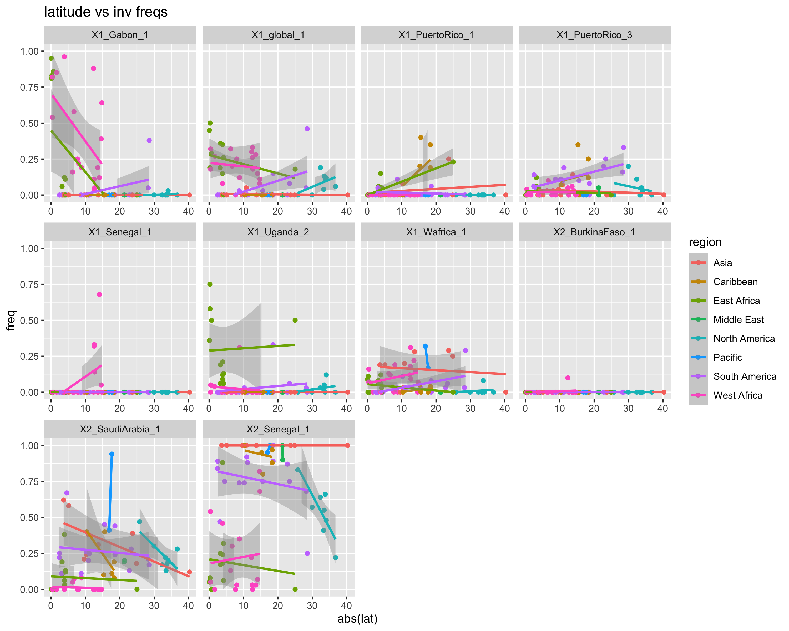

```r
ggplot(popfreqsM,aes(x=popdens,y=freq,color=region)) + geom_point()  + 
  geom_smooth(method="lm") + facet_wrap("inversion",scale="free_x") + ylim(0,1) + scale_x_log10() +
  ggtitle("population density vs inv freqs")
```

```
## Warning: Transformation introduced infinite values in continuous x-axis
```

```
## Warning: Transformation introduced infinite values in continuous x-axis
```

```
## `geom_smooth()` using formula 'y ~ x'
```

```
## Warning: Removed 10 rows containing non-finite values (stat_smooth).
```

```
## Warning in qt((1 - level)/2, df): NaNs produced

## Warning in qt((1 - level)/2, df): NaNs produced

## Warning in qt((1 - level)/2, df): NaNs produced

## Warning in qt((1 - level)/2, df): NaNs produced

## Warning in qt((1 - level)/2, df): NaNs produced

## Warning in qt((1 - level)/2, df): NaNs produced

## Warning in qt((1 - level)/2, df): NaNs produced

## Warning in qt((1 - level)/2, df): NaNs produced

## Warning in qt((1 - level)/2, df): NaNs produced

## Warning in qt((1 - level)/2, df): NaNs produced

## Warning in qt((1 - level)/2, df): NaNs produced

## Warning in qt((1 - level)/2, df): NaNs produced

## Warning in qt((1 - level)/2, df): NaNs produced

## Warning in qt((1 - level)/2, df): NaNs produced

## Warning in qt((1 - level)/2, df): NaNs produced

## Warning in qt((1 - level)/2, df): NaNs produced

## Warning in qt((1 - level)/2, df): NaNs produced

## Warning in qt((1 - level)/2, df): NaNs produced

## Warning in qt((1 - level)/2, df): NaNs produced

## Warning in qt((1 - level)/2, df): NaNs produced
```

```
## Warning: Removed 225 rows containing missing values (geom_smooth).
```

```
## Warning in max(ids, na.rm = TRUE): no non-missing arguments to max; returning -Inf

## Warning in max(ids, na.rm = TRUE): no non-missing arguments to max; returning -Inf

## Warning in max(ids, na.rm = TRUE): no non-missing arguments to max; returning -Inf

## Warning in max(ids, na.rm = TRUE): no non-missing arguments to max; returning -Inf

## Warning in max(ids, na.rm = TRUE): no non-missing arguments to max; returning -Inf

## Warning in max(ids, na.rm = TRUE): no non-missing arguments to max; returning -Inf

## Warning in max(ids, na.rm = TRUE): no non-missing arguments to max; returning -Inf

## Warning in max(ids, na.rm = TRUE): no non-missing arguments to max; returning -Inf

## Warning in max(ids, na.rm = TRUE): no non-missing arguments to max; returning -Inf

## Warning in max(ids, na.rm = TRUE): no non-missing arguments to max; returning -Inf

## Warning in max(ids, na.rm = TRUE): no non-missing arguments to max; returning -Inf

## Warning in max(ids, na.rm = TRUE): no non-missing arguments to max; returning -Inf

## Warning in max(ids, na.rm = TRUE): no non-missing arguments to max; returning -Inf

## Warning in max(ids, na.rm = TRUE): no non-missing arguments to max; returning -Inf

## Warning in max(ids, na.rm = TRUE): no non-missing arguments to max; returning -Inf

## Warning in max(ids, na.rm = TRUE): no non-missing arguments to max; returning -Inf

## Warning in max(ids, na.rm = TRUE): no non-missing arguments to max; returning -Inf

## Warning in max(ids, na.rm = TRUE): no non-missing arguments to max; returning -Inf

## Warning in max(ids, na.rm = TRUE): no non-missing arguments to max; returning -Inf

## Warning in max(ids, na.rm = TRUE): no non-missing arguments to max; returning -Inf

## Warning in max(ids, na.rm = TRUE): no non-missing arguments to max; returning -Inf

## Warning in max(ids, na.rm = TRUE): no non-missing arguments to max; returning -Inf

## Warning in max(ids, na.rm = TRUE): no non-missing arguments to max; returning -Inf

## Warning in max(ids, na.rm = TRUE): no non-missing arguments to max; returning -Inf

## Warning in max(ids, na.rm = TRUE): no non-missing arguments to max; returning -Inf

## Warning in max(ids, na.rm = TRUE): no non-missing arguments to max; returning -Inf

## Warning in max(ids, na.rm = TRUE): no non-missing arguments to max; returning -Inf

## Warning in max(ids, na.rm = TRUE): no non-missing arguments to max; returning -Inf

## Warning in max(ids, na.rm = TRUE): no non-missing arguments to max; returning -Inf

## Warning in max(ids, na.rm = TRUE): no non-missing arguments to max; returning -Inf

## Warning in max(ids, na.rm = TRUE): no non-missing arguments to max; returning -Inf

## Warning in max(ids, na.rm = TRUE): no non-missing arguments to max; returning -Inf

## Warning in max(ids, na.rm = TRUE): no non-missing arguments to max; returning -Inf

## Warning in max(ids, na.rm = TRUE): no non-missing arguments to max; returning -Inf

## Warning in max(ids, na.rm = TRUE): no non-missing arguments to max; returning -Inf

## Warning in max(ids, na.rm = TRUE): no non-missing arguments to max; returning -Inf
```

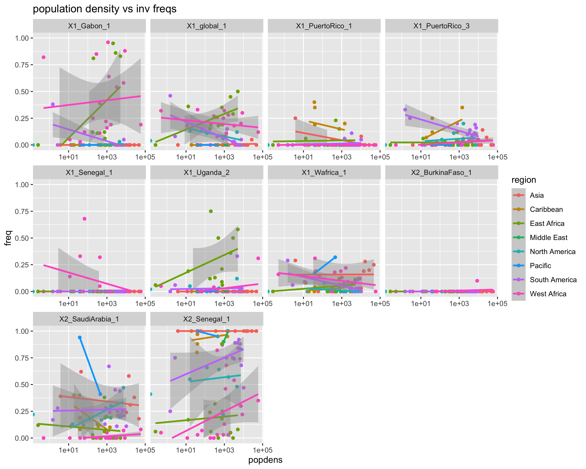

```r
ggplot(popfreqsM,aes(x=precipitation,y=freq,color=region)) + geom_point() + 
  geom_smooth(method="lm",se = F) + facet_wrap("inversion",scale="free_x") + ylim(0,1) +
  ggtitle("precipitation vs inv freqs")
```

```
## `geom_smooth()` using formula 'y ~ x'
```

```
## Warning: Removed 167 rows containing missing values (geom_smooth).
```

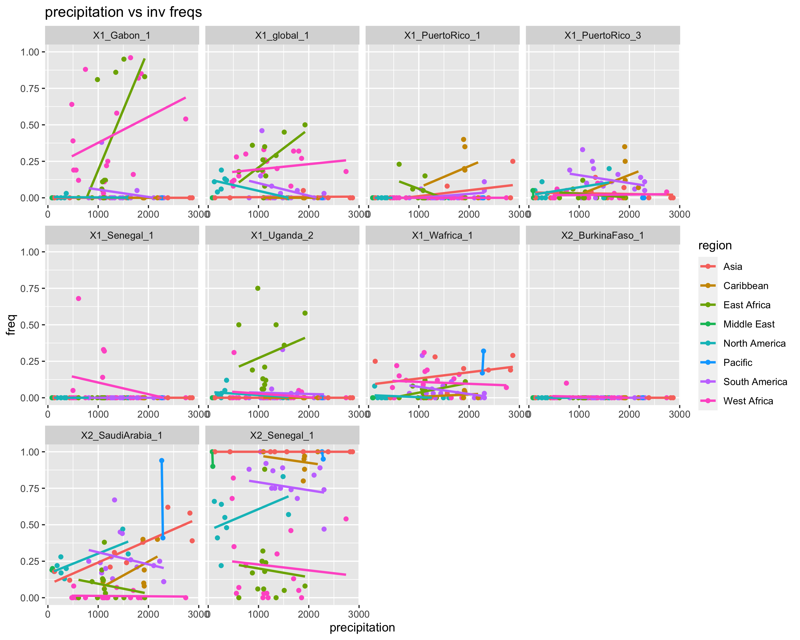

```r
ggplot(popfreqsM,aes(x=precseason,y=freq,color=region)) + geom_point() + 
  geom_smooth(method="lm",se = F) + facet_wrap("inversion",scale="free_x") + ylim(0,1) +
  ggtitle("precipitation seasonality vs inv freqs")
```

```
## `geom_smooth()` using formula 'y ~ x'
```

```
## Warning: Removed 159 rows containing missing values (geom_smooth).
```

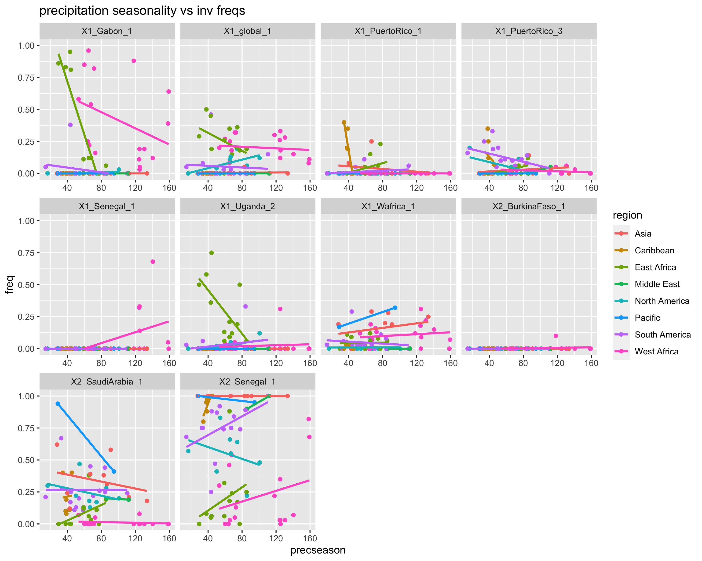

```r
ggplot(popfreqsM,aes(x=tempseason,y=freq,color=region)) + geom_point() + 
  geom_smooth(method="lm",se = F) + facet_wrap("inversion",scale="free_x") + ylim(0,1) +
  ggtitle("temperature seasonality vs inv freqs")
```

```
## `geom_smooth()` using formula 'y ~ x'
```

```
## Warning: Removed 140 rows containing missing values (geom_smooth).
```

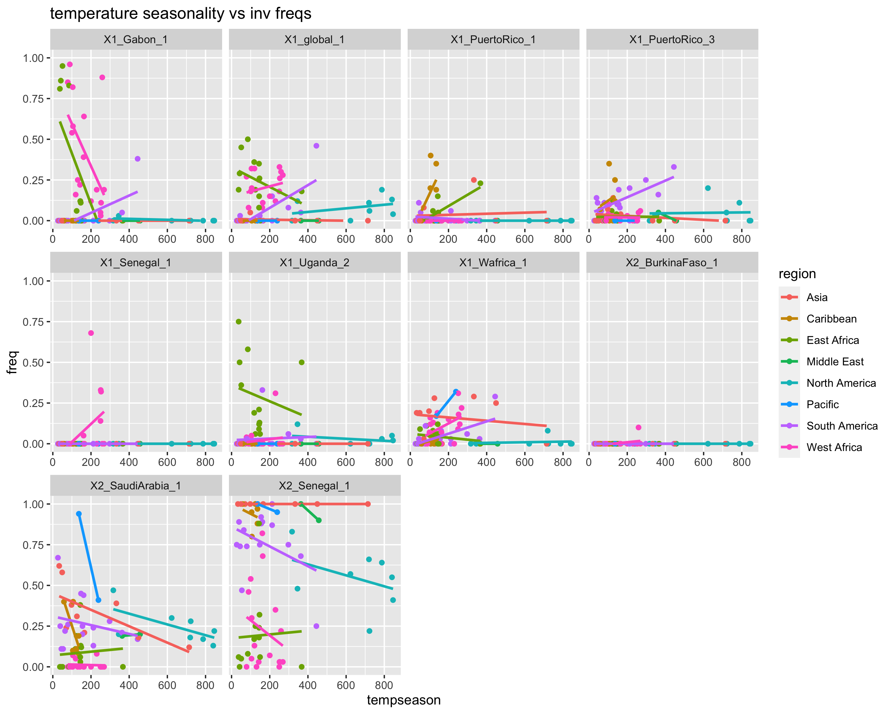

```r
ggplot(popfreqsM,aes(x=maxtemp,y=freq,color=region)) + geom_point() + 
  geom_smooth(method="lm",se = F) + facet_wrap("inversion",scale="free_x") + ylim(0,1) +
  ggtitle("max temp vs inv freqs")
```

```
## `geom_smooth()` using formula 'y ~ x'
```

```
## Warning: Removed 221 rows containing missing values (geom_smooth).
```

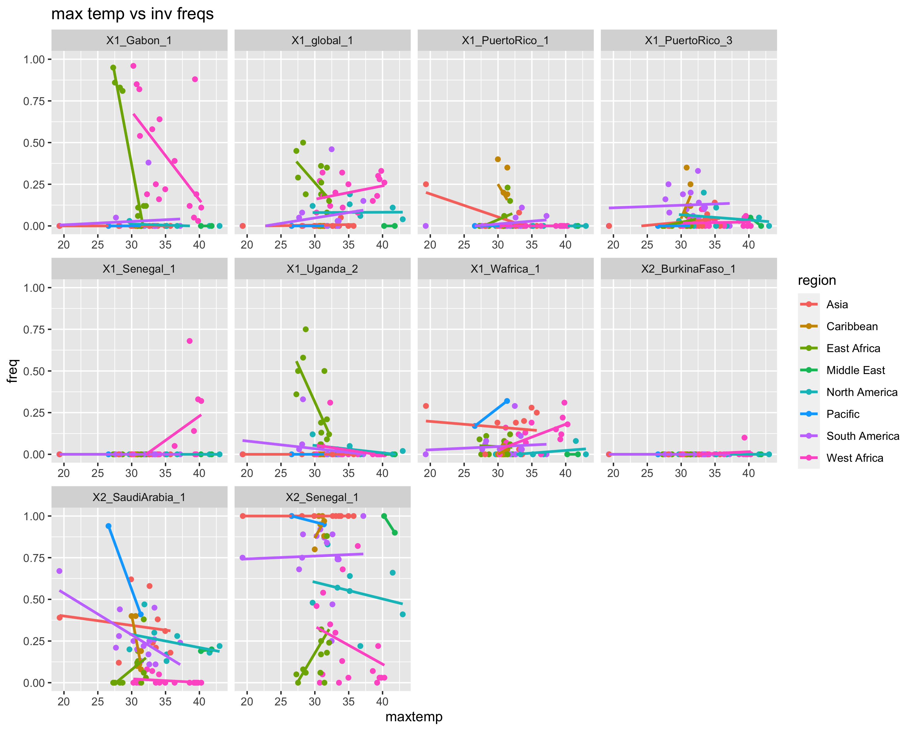

```r
ggplot(popfreqsM,aes(x=mintemp,y=freq,color=region)) + geom_point() + 
  geom_smooth(method="lm",se = F) + facet_wrap("inversion",scale="free_x") + ylim(0,1) +
  ggtitle("min temp vs inv freqs")
```

```
## `geom_smooth()` using formula 'y ~ x'
```

```
## Warning: Removed 174 rows containing missing values (geom_smooth).
```

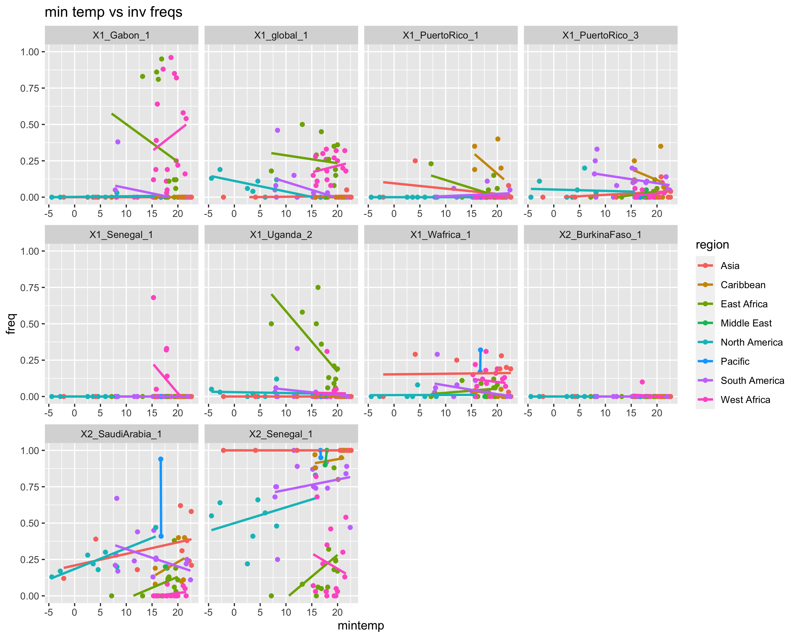


```r
popfreqsM2 <- pivot_longer(popfreqsM,cols=all_of(allvars),names_to = "variable",values_to = "value")

for(I in invnames) {

ivarplot <- ggplot(subset(popfreqsM2,inversion==I),aes(x=value,y=freq,color=region)) + geom_point()  + 
  geom_smooth(method="lm") + facet_wrap("variable",scale="free_x") + ylim(0,1) +
  ggtitle(paste(I,"vs climate/dem vars"))

print(ivarplot)
}
```

```
## `geom_smooth()` using formula 'y ~ x'
```

```
## Warning in qt((1 - level)/2, df): NaNs produced

## Warning in qt((1 - level)/2, df): NaNs produced

## Warning in qt((1 - level)/2, df): NaNs produced

## Warning in qt((1 - level)/2, df): NaNs produced

## Warning in qt((1 - level)/2, df): NaNs produced

## Warning in qt((1 - level)/2, df): NaNs produced

## Warning in qt((1 - level)/2, df): NaNs produced

## Warning in qt((1 - level)/2, df): NaNs produced

## Warning in qt((1 - level)/2, df): NaNs produced

## Warning in qt((1 - level)/2, df): NaNs produced

## Warning in qt((1 - level)/2, df): NaNs produced

## Warning in qt((1 - level)/2, df): NaNs produced

## Warning in qt((1 - level)/2, df): NaNs produced

## Warning in qt((1 - level)/2, df): NaNs produced
```

```
## Warning: Removed 291 rows containing missing values (geom_smooth).
```

```
## Warning in max(ids, na.rm = TRUE): no non-missing arguments to max; returning -Inf

## Warning in max(ids, na.rm = TRUE): no non-missing arguments to max; returning -Inf

## Warning in max(ids, na.rm = TRUE): no non-missing arguments to max; returning -Inf

## Warning in max(ids, na.rm = TRUE): no non-missing arguments to max; returning -Inf

## Warning in max(ids, na.rm = TRUE): no non-missing arguments to max; returning -Inf

## Warning in max(ids, na.rm = TRUE): no non-missing arguments to max; returning -Inf

## Warning in max(ids, na.rm = TRUE): no non-missing arguments to max; returning -Inf

## Warning in max(ids, na.rm = TRUE): no non-missing arguments to max; returning -Inf

## Warning in max(ids, na.rm = TRUE): no non-missing arguments to max; returning -Inf

## Warning in max(ids, na.rm = TRUE): no non-missing arguments to max; returning -Inf

## Warning in max(ids, na.rm = TRUE): no non-missing arguments to max; returning -Inf

## Warning in max(ids, na.rm = TRUE): no non-missing arguments to max; returning -Inf

## Warning in max(ids, na.rm = TRUE): no non-missing arguments to max; returning -Inf

## Warning in max(ids, na.rm = TRUE): no non-missing arguments to max; returning -Inf

## Warning in max(ids, na.rm = TRUE): no non-missing arguments to max; returning -Inf

## Warning in max(ids, na.rm = TRUE): no non-missing arguments to max; returning -Inf

## Warning in max(ids, na.rm = TRUE): no non-missing arguments to max; returning -Inf

## Warning in max(ids, na.rm = TRUE): no non-missing arguments to max; returning -Inf

## Warning in max(ids, na.rm = TRUE): no non-missing arguments to max; returning -Inf

## Warning in max(ids, na.rm = TRUE): no non-missing arguments to max; returning -Inf

## Warning in max(ids, na.rm = TRUE): no non-missing arguments to max; returning -Inf

## Warning in max(ids, na.rm = TRUE): no non-missing arguments to max; returning -Inf

## Warning in max(ids, na.rm = TRUE): no non-missing arguments to max; returning -Inf

## Warning in max(ids, na.rm = TRUE): no non-missing arguments to max; returning -Inf

## Warning in max(ids, na.rm = TRUE): no non-missing arguments to max; returning -Inf

## Warning in max(ids, na.rm = TRUE): no non-missing arguments to max; returning -Inf
```

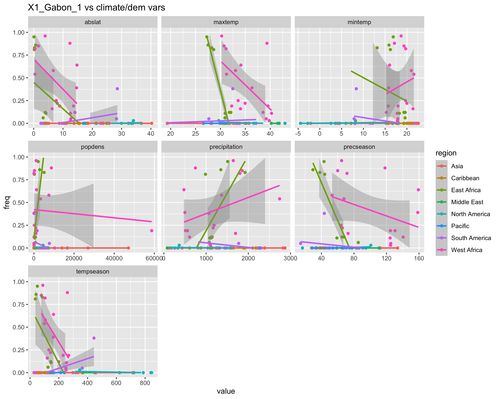

```
## `geom_smooth()` using formula 'y ~ x'
```

```
## Warning in qt((1 - level)/2, df): NaNs produced
```

```
## Warning in qt((1 - level)/2, df): NaNs produced

## Warning in qt((1 - level)/2, df): NaNs produced

## Warning in qt((1 - level)/2, df): NaNs produced

## Warning in qt((1 - level)/2, df): NaNs produced

## Warning in qt((1 - level)/2, df): NaNs produced

## Warning in qt((1 - level)/2, df): NaNs produced

## Warning in qt((1 - level)/2, df): NaNs produced

## Warning in qt((1 - level)/2, df): NaNs produced

## Warning in qt((1 - level)/2, df): NaNs produced

## Warning in qt((1 - level)/2, df): NaNs produced

## Warning in qt((1 - level)/2, df): NaNs produced

## Warning in qt((1 - level)/2, df): NaNs produced

## Warning in qt((1 - level)/2, df): NaNs produced
```

```
## Warning: Removed 142 rows containing missing values (geom_smooth).
```

```
## Warning in max(ids, na.rm = TRUE): no non-missing arguments to max; returning -Inf

## Warning in max(ids, na.rm = TRUE): no non-missing arguments to max; returning -Inf

## Warning in max(ids, na.rm = TRUE): no non-missing arguments to max; returning -Inf

## Warning in max(ids, na.rm = TRUE): no non-missing arguments to max; returning -Inf

## Warning in max(ids, na.rm = TRUE): no non-missing arguments to max; returning -Inf

## Warning in max(ids, na.rm = TRUE): no non-missing arguments to max; returning -Inf

## Warning in max(ids, na.rm = TRUE): no non-missing arguments to max; returning -Inf

## Warning in max(ids, na.rm = TRUE): no non-missing arguments to max; returning -Inf

## Warning in max(ids, na.rm = TRUE): no non-missing arguments to max; returning -Inf

## Warning in max(ids, na.rm = TRUE): no non-missing arguments to max; returning -Inf

## Warning in max(ids, na.rm = TRUE): no non-missing arguments to max; returning -Inf

## Warning in max(ids, na.rm = TRUE): no non-missing arguments to max; returning -Inf

## Warning in max(ids, na.rm = TRUE): no non-missing arguments to max; returning -Inf

## Warning in max(ids, na.rm = TRUE): no non-missing arguments to max; returning -Inf

## Warning in max(ids, na.rm = TRUE): no non-missing arguments to max; returning -Inf

## Warning in max(ids, na.rm = TRUE): no non-missing arguments to max; returning -Inf

## Warning in max(ids, na.rm = TRUE): no non-missing arguments to max; returning -Inf

## Warning in max(ids, na.rm = TRUE): no non-missing arguments to max; returning -Inf

## Warning in max(ids, na.rm = TRUE): no non-missing arguments to max; returning -Inf

## Warning in max(ids, na.rm = TRUE): no non-missing arguments to max; returning -Inf

## Warning in max(ids, na.rm = TRUE): no non-missing arguments to max; returning -Inf

## Warning in max(ids, na.rm = TRUE): no non-missing arguments to max; returning -Inf

## Warning in max(ids, na.rm = TRUE): no non-missing arguments to max; returning -Inf
```

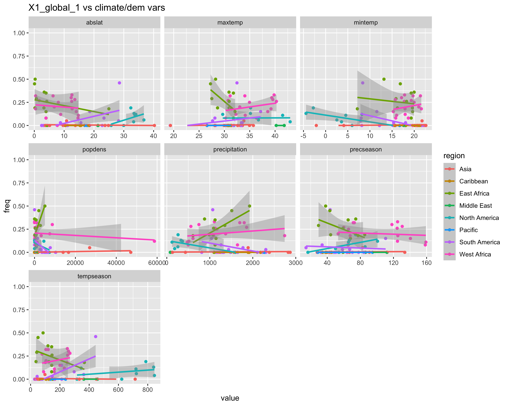

```
## `geom_smooth()` using formula 'y ~ x'
```

```
## Warning in qt((1 - level)/2, df): NaNs produced
```

```
## Warning in qt((1 - level)/2, df): NaNs produced

## Warning in qt((1 - level)/2, df): NaNs produced

## Warning in qt((1 - level)/2, df): NaNs produced

## Warning in qt((1 - level)/2, df): NaNs produced

## Warning in qt((1 - level)/2, df): NaNs produced

## Warning in qt((1 - level)/2, df): NaNs produced

## Warning in qt((1 - level)/2, df): NaNs produced

## Warning in qt((1 - level)/2, df): NaNs produced

## Warning in qt((1 - level)/2, df): NaNs produced

## Warning in qt((1 - level)/2, df): NaNs produced

## Warning in qt((1 - level)/2, df): NaNs produced

## Warning in qt((1 - level)/2, df): NaNs produced

## Warning in qt((1 - level)/2, df): NaNs produced
```

```
## Warning: Removed 182 rows containing missing values (geom_smooth).
```

```
## Warning in max(ids, na.rm = TRUE): no non-missing arguments to max; returning -Inf

## Warning in max(ids, na.rm = TRUE): no non-missing arguments to max; returning -Inf

## Warning in max(ids, na.rm = TRUE): no non-missing arguments to max; returning -Inf

## Warning in max(ids, na.rm = TRUE): no non-missing arguments to max; returning -Inf

## Warning in max(ids, na.rm = TRUE): no non-missing arguments to max; returning -Inf

## Warning in max(ids, na.rm = TRUE): no non-missing arguments to max; returning -Inf

## Warning in max(ids, na.rm = TRUE): no non-missing arguments to max; returning -Inf

## Warning in max(ids, na.rm = TRUE): no non-missing arguments to max; returning -Inf

## Warning in max(ids, na.rm = TRUE): no non-missing arguments to max; returning -Inf

## Warning in max(ids, na.rm = TRUE): no non-missing arguments to max; returning -Inf

## Warning in max(ids, na.rm = TRUE): no non-missing arguments to max; returning -Inf

## Warning in max(ids, na.rm = TRUE): no non-missing arguments to max; returning -Inf

## Warning in max(ids, na.rm = TRUE): no non-missing arguments to max; returning -Inf

## Warning in max(ids, na.rm = TRUE): no non-missing arguments to max; returning -Inf

## Warning in max(ids, na.rm = TRUE): no non-missing arguments to max; returning -Inf

## Warning in max(ids, na.rm = TRUE): no non-missing arguments to max; returning -Inf

## Warning in max(ids, na.rm = TRUE): no non-missing arguments to max; returning -Inf

## Warning in max(ids, na.rm = TRUE): no non-missing arguments to max; returning -Inf

## Warning in max(ids, na.rm = TRUE): no non-missing arguments to max; returning -Inf

## Warning in max(ids, na.rm = TRUE): no non-missing arguments to max; returning -Inf

## Warning in max(ids, na.rm = TRUE): no non-missing arguments to max; returning -Inf

## Warning in max(ids, na.rm = TRUE): no non-missing arguments to max; returning -Inf

## Warning in max(ids, na.rm = TRUE): no non-missing arguments to max; returning -Inf

## Warning in max(ids, na.rm = TRUE): no non-missing arguments to max; returning -Inf

## Warning in max(ids, na.rm = TRUE): no non-missing arguments to max; returning -Inf

## Warning in max(ids, na.rm = TRUE): no non-missing arguments to max; returning -Inf

## Warning in max(ids, na.rm = TRUE): no non-missing arguments to max; returning -Inf

## Warning in max(ids, na.rm = TRUE): no non-missing arguments to max; returning -Inf

## Warning in max(ids, na.rm = TRUE): no non-missing arguments to max; returning -Inf
```

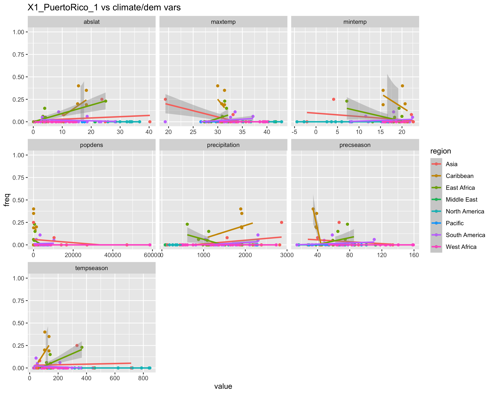

```
## `geom_smooth()` using formula 'y ~ x'
```

```
## Warning in qt((1 - level)/2, df): NaNs produced
```

```
## Warning in qt((1 - level)/2, df): NaNs produced

## Warning in qt((1 - level)/2, df): NaNs produced

## Warning in qt((1 - level)/2, df): NaNs produced

## Warning in qt((1 - level)/2, df): NaNs produced

## Warning in qt((1 - level)/2, df): NaNs produced

## Warning in qt((1 - level)/2, df): NaNs produced

## Warning in qt((1 - level)/2, df): NaNs produced

## Warning in qt((1 - level)/2, df): NaNs produced

## Warning in qt((1 - level)/2, df): NaNs produced

## Warning in qt((1 - level)/2, df): NaNs produced

## Warning in qt((1 - level)/2, df): NaNs produced

## Warning in qt((1 - level)/2, df): NaNs produced

## Warning in qt((1 - level)/2, df): NaNs produced
```

```
## Warning: Removed 111 rows containing missing values (geom_smooth).
```

```
## Warning in max(ids, na.rm = TRUE): no non-missing arguments to max; returning -Inf

## Warning in max(ids, na.rm = TRUE): no non-missing arguments to max; returning -Inf

## Warning in max(ids, na.rm = TRUE): no non-missing arguments to max; returning -Inf

## Warning in max(ids, na.rm = TRUE): no non-missing arguments to max; returning -Inf

## Warning in max(ids, na.rm = TRUE): no non-missing arguments to max; returning -Inf

## Warning in max(ids, na.rm = TRUE): no non-missing arguments to max; returning -Inf

## Warning in max(ids, na.rm = TRUE): no non-missing arguments to max; returning -Inf

## Warning in max(ids, na.rm = TRUE): no non-missing arguments to max; returning -Inf

## Warning in max(ids, na.rm = TRUE): no non-missing arguments to max; returning -Inf

## Warning in max(ids, na.rm = TRUE): no non-missing arguments to max; returning -Inf

## Warning in max(ids, na.rm = TRUE): no non-missing arguments to max; returning -Inf

## Warning in max(ids, na.rm = TRUE): no non-missing arguments to max; returning -Inf

## Warning in max(ids, na.rm = TRUE): no non-missing arguments to max; returning -Inf

## Warning in max(ids, na.rm = TRUE): no non-missing arguments to max; returning -Inf

## Warning in max(ids, na.rm = TRUE): no non-missing arguments to max; returning -Inf

## Warning in max(ids, na.rm = TRUE): no non-missing arguments to max; returning -Inf

## Warning in max(ids, na.rm = TRUE): no non-missing arguments to max; returning -Inf

## Warning in max(ids, na.rm = TRUE): no non-missing arguments to max; returning -Inf

## Warning in max(ids, na.rm = TRUE): no non-missing arguments to max; returning -Inf

## Warning in max(ids, na.rm = TRUE): no non-missing arguments to max; returning -Inf

## Warning in max(ids, na.rm = TRUE): no non-missing arguments to max; returning -Inf

## Warning in max(ids, na.rm = TRUE): no non-missing arguments to max; returning -Inf

## Warning in max(ids, na.rm = TRUE): no non-missing arguments to max; returning -Inf

## Warning in max(ids, na.rm = TRUE): no non-missing arguments to max; returning -Inf

## Warning in max(ids, na.rm = TRUE): no non-missing arguments to max; returning -Inf

## Warning in max(ids, na.rm = TRUE): no non-missing arguments to max; returning -Inf

## Warning in max(ids, na.rm = TRUE): no non-missing arguments to max; returning -Inf

## Warning in max(ids, na.rm = TRUE): no non-missing arguments to max; returning -Inf

## Warning in max(ids, na.rm = TRUE): no non-missing arguments to max; returning -Inf

## Warning in max(ids, na.rm = TRUE): no non-missing arguments to max; returning -Inf

## Warning in max(ids, na.rm = TRUE): no non-missing arguments to max; returning -Inf

## Warning in max(ids, na.rm = TRUE): no non-missing arguments to max; returning -Inf

## Warning in max(ids, na.rm = TRUE): no non-missing arguments to max; returning -Inf

## Warning in max(ids, na.rm = TRUE): no non-missing arguments to max; returning -Inf

## Warning in max(ids, na.rm = TRUE): no non-missing arguments to max; returning -Inf
```

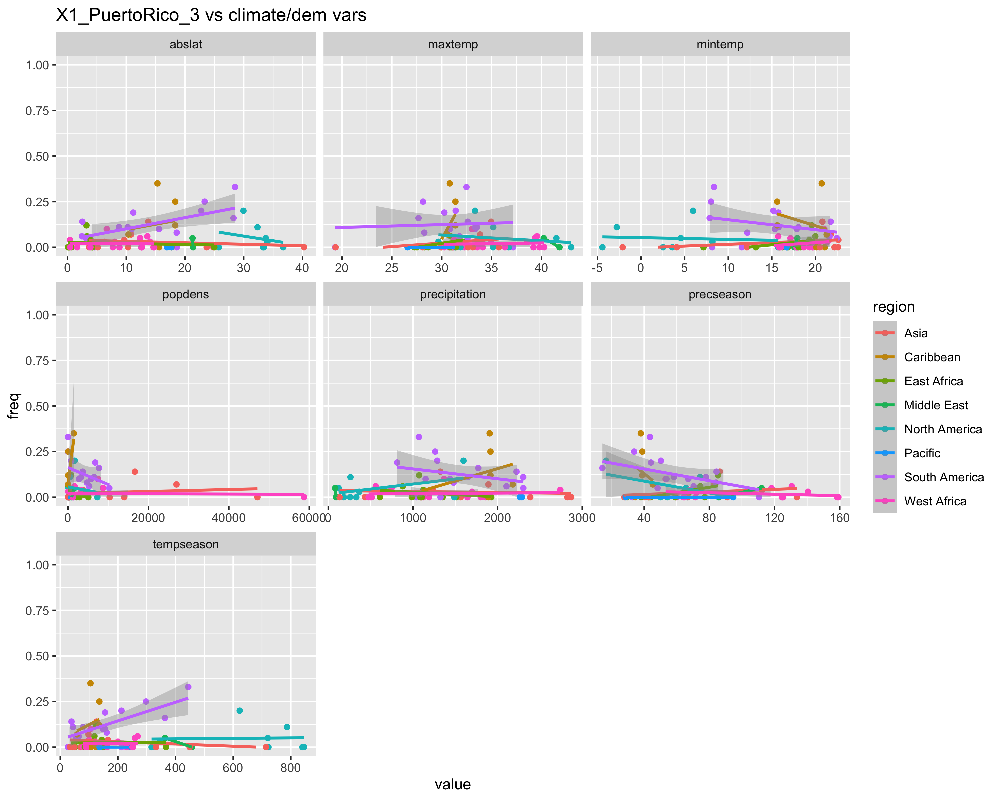

```
## `geom_smooth()` using formula 'y ~ x'
```

```
## Warning in qt((1 - level)/2, df): NaNs produced
```

```
## Warning in qt((1 - level)/2, df): NaNs produced

## Warning in qt((1 - level)/2, df): NaNs produced

## Warning in qt((1 - level)/2, df): NaNs produced

## Warning in qt((1 - level)/2, df): NaNs produced

## Warning in qt((1 - level)/2, df): NaNs produced

## Warning in qt((1 - level)/2, df): NaNs produced

## Warning in qt((1 - level)/2, df): NaNs produced

## Warning in qt((1 - level)/2, df): NaNs produced

## Warning in qt((1 - level)/2, df): NaNs produced

## Warning in qt((1 - level)/2, df): NaNs produced

## Warning in qt((1 - level)/2, df): NaNs produced

## Warning in qt((1 - level)/2, df): NaNs produced

## Warning in qt((1 - level)/2, df): NaNs produced
```

```
## Warning: Removed 94 rows containing missing values (geom_smooth).
```

```
## Warning in max(ids, na.rm = TRUE): no non-missing arguments to max; returning -Inf

## Warning in max(ids, na.rm = TRUE): no non-missing arguments to max; returning -Inf

## Warning in max(ids, na.rm = TRUE): no non-missing arguments to max; returning -Inf

## Warning in max(ids, na.rm = TRUE): no non-missing arguments to max; returning -Inf

## Warning in max(ids, na.rm = TRUE): no non-missing arguments to max; returning -Inf

## Warning in max(ids, na.rm = TRUE): no non-missing arguments to max; returning -Inf

## Warning in max(ids, na.rm = TRUE): no non-missing arguments to max; returning -Inf

## Warning in max(ids, na.rm = TRUE): no non-missing arguments to max; returning -Inf

## Warning in max(ids, na.rm = TRUE): no non-missing arguments to max; returning -Inf

## Warning in max(ids, na.rm = TRUE): no non-missing arguments to max; returning -Inf

## Warning in max(ids, na.rm = TRUE): no non-missing arguments to max; returning -Inf

## Warning in max(ids, na.rm = TRUE): no non-missing arguments to max; returning -Inf

## Warning in max(ids, na.rm = TRUE): no non-missing arguments to max; returning -Inf

## Warning in max(ids, na.rm = TRUE): no non-missing arguments to max; returning -Inf

## Warning in max(ids, na.rm = TRUE): no non-missing arguments to max; returning -Inf
```

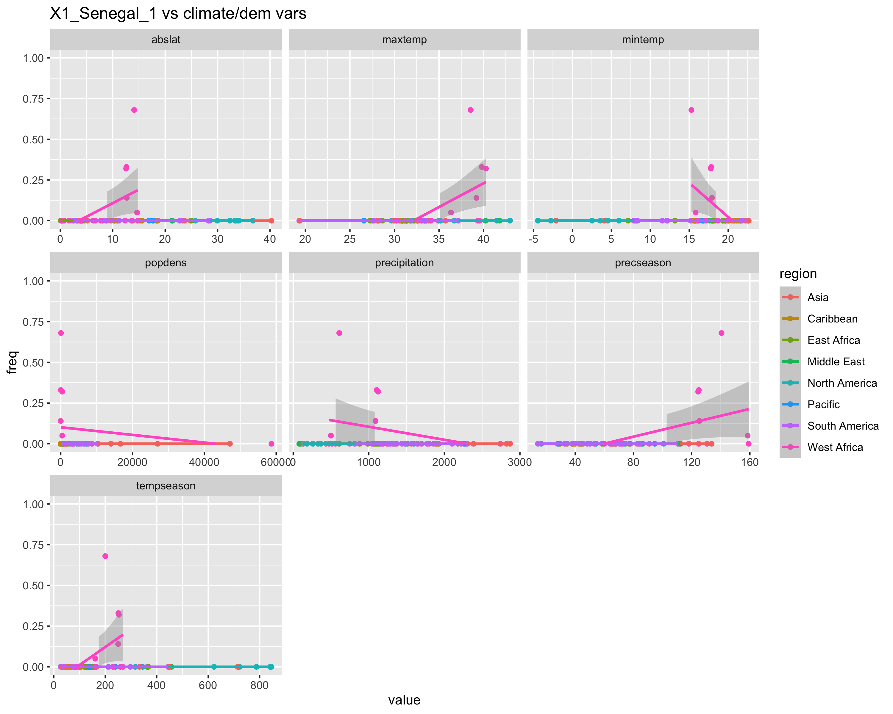

```
## `geom_smooth()` using formula 'y ~ x'
```

```
## Warning in qt((1 - level)/2, df): NaNs produced
```

```
## Warning in qt((1 - level)/2, df): NaNs produced

## Warning in qt((1 - level)/2, df): NaNs produced

## Warning in qt((1 - level)/2, df): NaNs produced

## Warning in qt((1 - level)/2, df): NaNs produced

## Warning in qt((1 - level)/2, df): NaNs produced

## Warning in qt((1 - level)/2, df): NaNs produced

## Warning in qt((1 - level)/2, df): NaNs produced

## Warning in qt((1 - level)/2, df): NaNs produced

## Warning in qt((1 - level)/2, df): NaNs produced

## Warning in qt((1 - level)/2, df): NaNs produced

## Warning in qt((1 - level)/2, df): NaNs produced

## Warning in qt((1 - level)/2, df): NaNs produced

## Warning in qt((1 - level)/2, df): NaNs produced
```

```
## Warning: Removed 64 rows containing missing values (geom_smooth).
```

```
## Warning in max(ids, na.rm = TRUE): no non-missing arguments to max; returning -Inf

## Warning in max(ids, na.rm = TRUE): no non-missing arguments to max; returning -Inf

## Warning in max(ids, na.rm = TRUE): no non-missing arguments to max; returning -Inf

## Warning in max(ids, na.rm = TRUE): no non-missing arguments to max; returning -Inf

## Warning in max(ids, na.rm = TRUE): no non-missing arguments to max; returning -Inf

## Warning in max(ids, na.rm = TRUE): no non-missing arguments to max; returning -Inf

## Warning in max(ids, na.rm = TRUE): no non-missing arguments to max; returning -Inf

## Warning in max(ids, na.rm = TRUE): no non-missing arguments to max; returning -Inf

## Warning in max(ids, na.rm = TRUE): no non-missing arguments to max; returning -Inf

## Warning in max(ids, na.rm = TRUE): no non-missing arguments to max; returning -Inf

## Warning in max(ids, na.rm = TRUE): no non-missing arguments to max; returning -Inf

## Warning in max(ids, na.rm = TRUE): no non-missing arguments to max; returning -Inf

## Warning in max(ids, na.rm = TRUE): no non-missing arguments to max; returning -Inf

## Warning in max(ids, na.rm = TRUE): no non-missing arguments to max; returning -Inf

## Warning in max(ids, na.rm = TRUE): no non-missing arguments to max; returning -Inf

## Warning in max(ids, na.rm = TRUE): no non-missing arguments to max; returning -Inf

## Warning in max(ids, na.rm = TRUE): no non-missing arguments to max; returning -Inf

## Warning in max(ids, na.rm = TRUE): no non-missing arguments to max; returning -Inf

## Warning in max(ids, na.rm = TRUE): no non-missing arguments to max; returning -Inf

## Warning in max(ids, na.rm = TRUE): no non-missing arguments to max; returning -Inf

## Warning in max(ids, na.rm = TRUE): no non-missing arguments to max; returning -Inf

## Warning in max(ids, na.rm = TRUE): no non-missing arguments to max; returning -Inf

## Warning in max(ids, na.rm = TRUE): no non-missing arguments to max; returning -Inf

## Warning in max(ids, na.rm = TRUE): no non-missing arguments to max; returning -Inf

## Warning in max(ids, na.rm = TRUE): no non-missing arguments to max; returning -Inf

## Warning in max(ids, na.rm = TRUE): no non-missing arguments to max; returning -Inf

## Warning in max(ids, na.rm = TRUE): no non-missing arguments to max; returning -Inf

## Warning in max(ids, na.rm = TRUE): no non-missing arguments to max; returning -Inf

## Warning in max(ids, na.rm = TRUE): no non-missing arguments to max; returning -Inf

## Warning in max(ids, na.rm = TRUE): no non-missing arguments to max; returning -Inf

## Warning in max(ids, na.rm = TRUE): no non-missing arguments to max; returning -Inf

## Warning in max(ids, na.rm = TRUE): no non-missing arguments to max; returning -Inf

## Warning in max(ids, na.rm = TRUE): no non-missing arguments to max; returning -Inf
```

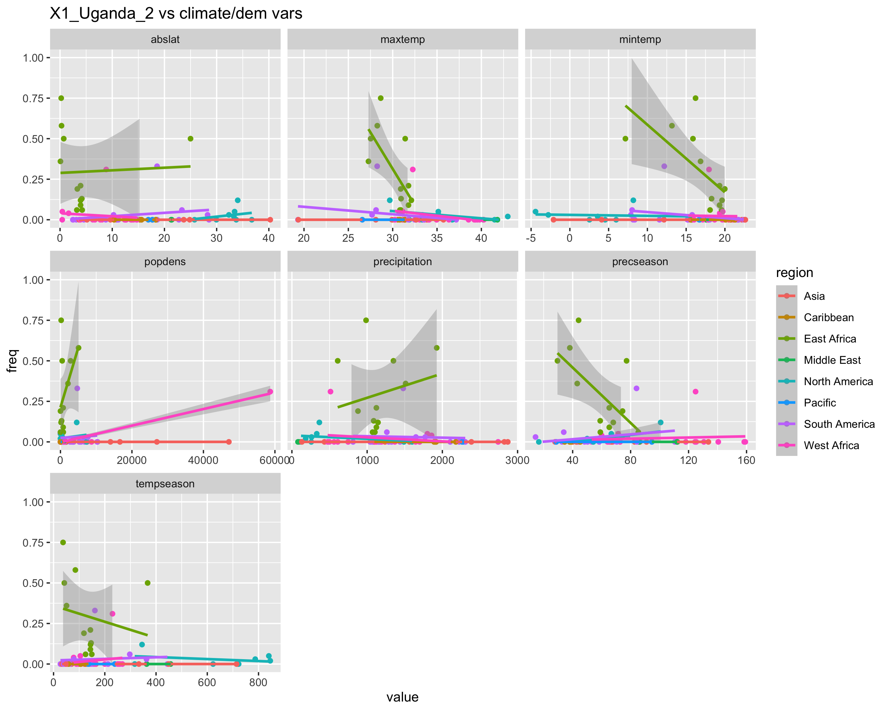

```
## `geom_smooth()` using formula 'y ~ x'
```

```
## Warning in qt((1 - level)/2, df): NaNs produced
```

```
## Warning in qt((1 - level)/2, df): NaNs produced

## Warning in qt((1 - level)/2, df): NaNs produced

## Warning in qt((1 - level)/2, df): NaNs produced

## Warning in qt((1 - level)/2, df): NaNs produced

## Warning in qt((1 - level)/2, df): NaNs produced

## Warning in qt((1 - level)/2, df): NaNs produced

## Warning in qt((1 - level)/2, df): NaNs produced

## Warning in qt((1 - level)/2, df): NaNs produced

## Warning in qt((1 - level)/2, df): NaNs produced

## Warning in qt((1 - level)/2, df): NaNs produced

## Warning in qt((1 - level)/2, df): NaNs produced

## Warning in qt((1 - level)/2, df): NaNs produced

## Warning in qt((1 - level)/2, df): NaNs produced
```

```
## Warning: Removed 62 rows containing missing values (geom_smooth).
```

```
## Warning in max(ids, na.rm = TRUE): no non-missing arguments to max; returning -Inf

## Warning in max(ids, na.rm = TRUE): no non-missing arguments to max; returning -Inf

## Warning in max(ids, na.rm = TRUE): no non-missing arguments to max; returning -Inf

## Warning in max(ids, na.rm = TRUE): no non-missing arguments to max; returning -Inf

## Warning in max(ids, na.rm = TRUE): no non-missing arguments to max; returning -Inf

## Warning in max(ids, na.rm = TRUE): no non-missing arguments to max; returning -Inf

## Warning in max(ids, na.rm = TRUE): no non-missing arguments to max; returning -Inf

## Warning in max(ids, na.rm = TRUE): no non-missing arguments to max; returning -Inf

## Warning in max(ids, na.rm = TRUE): no non-missing arguments to max; returning -Inf

## Warning in max(ids, na.rm = TRUE): no non-missing arguments to max; returning -Inf

## Warning in max(ids, na.rm = TRUE): no non-missing arguments to max; returning -Inf

## Warning in max(ids, na.rm = TRUE): no non-missing arguments to max; returning -Inf

## Warning in max(ids, na.rm = TRUE): no non-missing arguments to max; returning -Inf

## Warning in max(ids, na.rm = TRUE): no non-missing arguments to max; returning -Inf

## Warning in max(ids, na.rm = TRUE): no non-missing arguments to max; returning -Inf

## Warning in max(ids, na.rm = TRUE): no non-missing arguments to max; returning -Inf

## Warning in max(ids, na.rm = TRUE): no non-missing arguments to max; returning -Inf

## Warning in max(ids, na.rm = TRUE): no non-missing arguments to max; returning -Inf

## Warning in max(ids, na.rm = TRUE): no non-missing arguments to max; returning -Inf

## Warning in max(ids, na.rm = TRUE): no non-missing arguments to max; returning -Inf

## Warning in max(ids, na.rm = TRUE): no non-missing arguments to max; returning -Inf

## Warning in max(ids, na.rm = TRUE): no non-missing arguments to max; returning -Inf

## Warning in max(ids, na.rm = TRUE): no non-missing arguments to max; returning -Inf

## Warning in max(ids, na.rm = TRUE): no non-missing arguments to max; returning -Inf

## Warning in max(ids, na.rm = TRUE): no non-missing arguments to max; returning -Inf

## Warning in max(ids, na.rm = TRUE): no non-missing arguments to max; returning -Inf

## Warning in max(ids, na.rm = TRUE): no non-missing arguments to max; returning -Inf

## Warning in max(ids, na.rm = TRUE): no non-missing arguments to max; returning -Inf
```

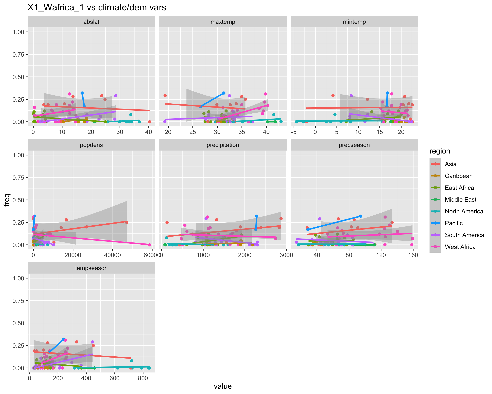

```
## `geom_smooth()` using formula 'y ~ x'
```

```
## Warning in qt((1 - level)/2, df): NaNs produced
```

```
## Warning in qt((1 - level)/2, df): NaNs produced

## Warning in qt((1 - level)/2, df): NaNs produced

## Warning in qt((1 - level)/2, df): NaNs produced

## Warning in qt((1 - level)/2, df): NaNs produced

## Warning in qt((1 - level)/2, df): NaNs produced

## Warning in qt((1 - level)/2, df): NaNs produced

## Warning in qt((1 - level)/2, df): NaNs produced

## Warning in qt((1 - level)/2, df): NaNs produced

## Warning in qt((1 - level)/2, df): NaNs produced

## Warning in qt((1 - level)/2, df): NaNs produced

## Warning in qt((1 - level)/2, df): NaNs produced

## Warning in qt((1 - level)/2, df): NaNs produced

## Warning in qt((1 - level)/2, df): NaNs produced
```

```
## Warning: Removed 72 rows containing missing values (geom_smooth).
```

```
## Warning in max(ids, na.rm = TRUE): no non-missing arguments to max; returning -Inf

## Warning in max(ids, na.rm = TRUE): no non-missing arguments to max; returning -Inf

## Warning in max(ids, na.rm = TRUE): no non-missing arguments to max; returning -Inf

## Warning in max(ids, na.rm = TRUE): no non-missing arguments to max; returning -Inf

## Warning in max(ids, na.rm = TRUE): no non-missing arguments to max; returning -Inf

## Warning in max(ids, na.rm = TRUE): no non-missing arguments to max; returning -Inf

## Warning in max(ids, na.rm = TRUE): no non-missing arguments to max; returning -Inf

## Warning in max(ids, na.rm = TRUE): no non-missing arguments to max; returning -Inf

## Warning in max(ids, na.rm = TRUE): no non-missing arguments to max; returning -Inf

## Warning in max(ids, na.rm = TRUE): no non-missing arguments to max; returning -Inf

## Warning in max(ids, na.rm = TRUE): no non-missing arguments to max; returning -Inf

## Warning in max(ids, na.rm = TRUE): no non-missing arguments to max; returning -Inf

## Warning in max(ids, na.rm = TRUE): no non-missing arguments to max; returning -Inf

## Warning in max(ids, na.rm = TRUE): no non-missing arguments to max; returning -Inf

## Warning in max(ids, na.rm = TRUE): no non-missing arguments to max; returning -Inf

## Warning in max(ids, na.rm = TRUE): no non-missing arguments to max; returning -Inf

## Warning in max(ids, na.rm = TRUE): no non-missing arguments to max; returning -Inf

## Warning in max(ids, na.rm = TRUE): no non-missing arguments to max; returning -Inf

## Warning in max(ids, na.rm = TRUE): no non-missing arguments to max; returning -Inf

## Warning in max(ids, na.rm = TRUE): no non-missing arguments to max; returning -Inf

## Warning in max(ids, na.rm = TRUE): no non-missing arguments to max; returning -Inf
```

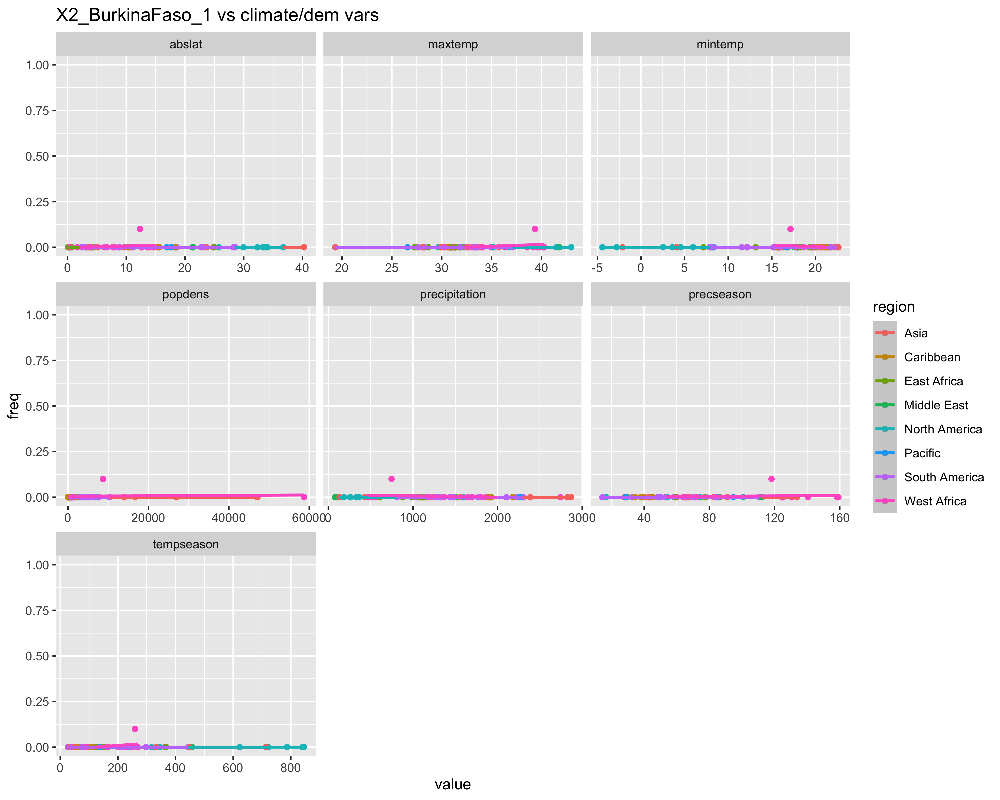

```
## `geom_smooth()` using formula 'y ~ x'
```

```
## Warning in qt((1 - level)/2, df): NaNs produced
```

```
## Warning in qt((1 - level)/2, df): NaNs produced

## Warning in qt((1 - level)/2, df): NaNs produced

## Warning in qt((1 - level)/2, df): NaNs produced

## Warning in qt((1 - level)/2, df): NaNs produced

## Warning in qt((1 - level)/2, df): NaNs produced

## Warning in qt((1 - level)/2, df): NaNs produced

## Warning in qt((1 - level)/2, df): NaNs produced

## Warning in qt((1 - level)/2, df): NaNs produced

## Warning in qt((1 - level)/2, df): NaNs produced

## Warning in qt((1 - level)/2, df): NaNs produced

## Warning in qt((1 - level)/2, df): NaNs produced

## Warning in qt((1 - level)/2, df): NaNs produced

## Warning in qt((1 - level)/2, df): NaNs produced
```

```
## Warning: Removed 51 rows containing missing values (geom_smooth).
```

```
## Warning in max(ids, na.rm = TRUE): no non-missing arguments to max; returning -Inf

## Warning in max(ids, na.rm = TRUE): no non-missing arguments to max; returning -Inf

## Warning in max(ids, na.rm = TRUE): no non-missing arguments to max; returning -Inf

## Warning in max(ids, na.rm = TRUE): no non-missing arguments to max; returning -Inf

## Warning in max(ids, na.rm = TRUE): no non-missing arguments to max; returning -Inf

## Warning in max(ids, na.rm = TRUE): no non-missing arguments to max; returning -Inf

## Warning in max(ids, na.rm = TRUE): no non-missing arguments to max; returning -Inf

## Warning in max(ids, na.rm = TRUE): no non-missing arguments to max; returning -Inf

## Warning in max(ids, na.rm = TRUE): no non-missing arguments to max; returning -Inf

## Warning in max(ids, na.rm = TRUE): no non-missing arguments to max; returning -Inf

## Warning in max(ids, na.rm = TRUE): no non-missing arguments to max; returning -Inf

## Warning in max(ids, na.rm = TRUE): no non-missing arguments to max; returning -Inf

## Warning in max(ids, na.rm = TRUE): no non-missing arguments to max; returning -Inf

## Warning in max(ids, na.rm = TRUE): no non-missing arguments to max; returning -Inf

## Warning in max(ids, na.rm = TRUE): no non-missing arguments to max; returning -Inf

## Warning in max(ids, na.rm = TRUE): no non-missing arguments to max; returning -Inf

## Warning in max(ids, na.rm = TRUE): no non-missing arguments to max; returning -Inf

## Warning in max(ids, na.rm = TRUE): no non-missing arguments to max; returning -Inf
```

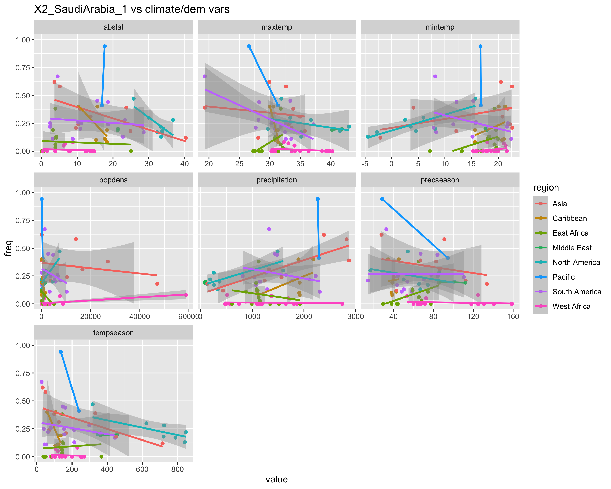

```
## `geom_smooth()` using formula 'y ~ x'
```

```
## Warning in qt((1 - level)/2, df): NaNs produced
```

```
## Warning in qt((1 - level)/2, df): NaNs produced

## Warning in qt((1 - level)/2, df): NaNs produced

## Warning in qt((1 - level)/2, df): NaNs produced

## Warning in qt((1 - level)/2, df): NaNs produced

## Warning in qt((1 - level)/2, df): NaNs produced

## Warning in qt((1 - level)/2, df): NaNs produced

## Warning in qt((1 - level)/2, df): NaNs produced

## Warning in qt((1 - level)/2, df): NaNs produced

## Warning in qt((1 - level)/2, df): NaNs produced

## Warning in qt((1 - level)/2, df): NaNs produced

## Warning in qt((1 - level)/2, df): NaNs produced

## Warning in qt((1 - level)/2, df): NaNs produced

## Warning in qt((1 - level)/2, df): NaNs produced
```

```
## Warning: Removed 42 rows containing missing values (geom_smooth).
```

```
## Warning in max(ids, na.rm = TRUE): no non-missing arguments to max; returning -Inf

## Warning in max(ids, na.rm = TRUE): no non-missing arguments to max; returning -Inf

## Warning in max(ids, na.rm = TRUE): no non-missing arguments to max; returning -Inf

## Warning in max(ids, na.rm = TRUE): no non-missing arguments to max; returning -Inf

## Warning in max(ids, na.rm = TRUE): no non-missing arguments to max; returning -Inf

## Warning in max(ids, na.rm = TRUE): no non-missing arguments to max; returning -Inf

## Warning in max(ids, na.rm = TRUE): no non-missing arguments to max; returning -Inf

## Warning in max(ids, na.rm = TRUE): no non-missing arguments to max; returning -Inf

## Warning in max(ids, na.rm = TRUE): no non-missing arguments to max; returning -Inf

## Warning in max(ids, na.rm = TRUE): no non-missing arguments to max; returning -Inf

## Warning in max(ids, na.rm = TRUE): no non-missing arguments to max; returning -Inf

## Warning in max(ids, na.rm = TRUE): no non-missing arguments to max; returning -Inf

## Warning in max(ids, na.rm = TRUE): no non-missing arguments to max; returning -Inf

## Warning in max(ids, na.rm = TRUE): no non-missing arguments to max; returning -Inf

## Warning in max(ids, na.rm = TRUE): no non-missing arguments to max; returning -Inf

## Warning in max(ids, na.rm = TRUE): no non-missing arguments to max; returning -Inf

## Warning in max(ids, na.rm = TRUE): no non-missing arguments to max; returning -Inf

## Warning in max(ids, na.rm = TRUE): no non-missing arguments to max; returning -Inf

## Warning in max(ids, na.rm = TRUE): no non-missing arguments to max; returning -Inf

## Warning in max(ids, na.rm = TRUE): no non-missing arguments to max; returning -Inf
```

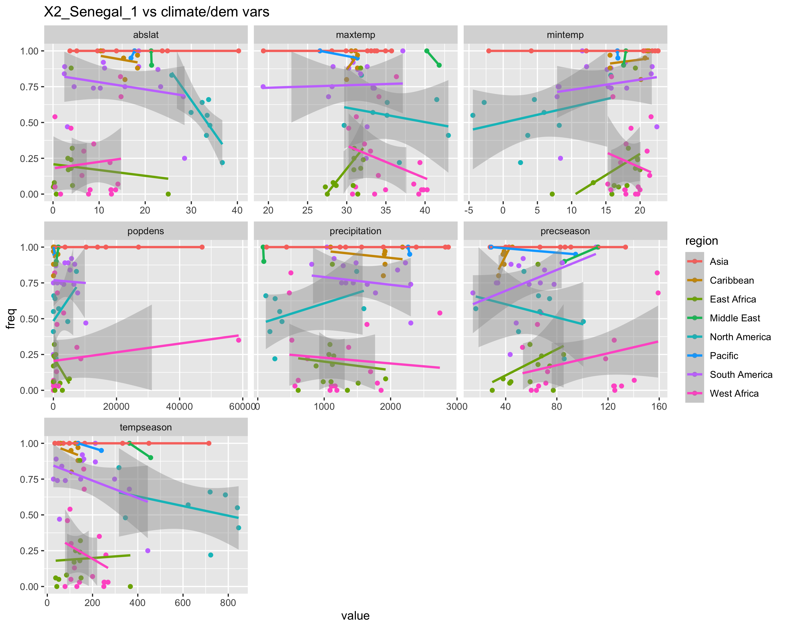


