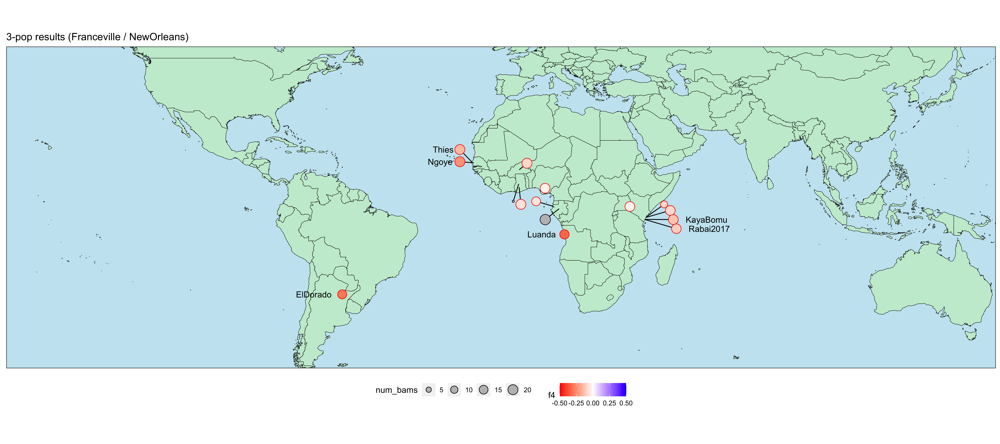
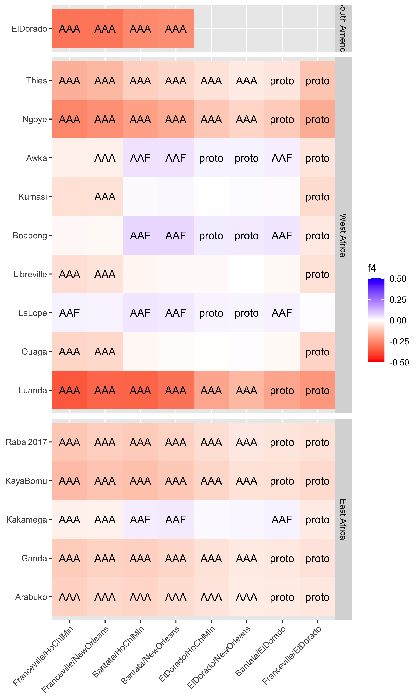
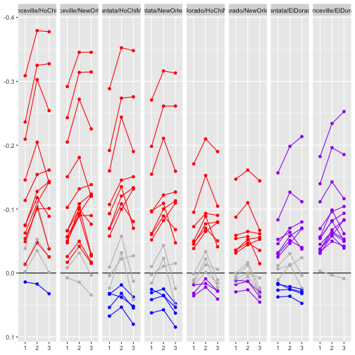
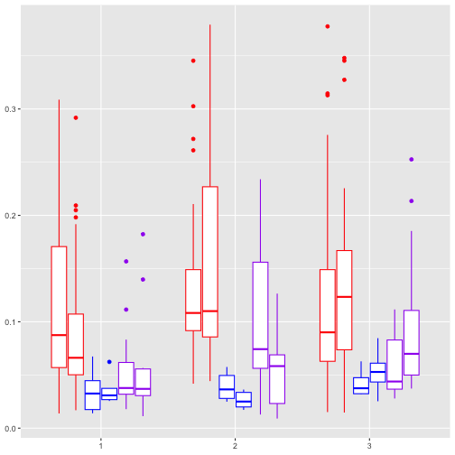

```r
library("tidyverse")

library("patchwork")
library("gridExtra")
library("plyr")
library("zoo")

library("ggrepel")
```


```r
library(maptools)
library(raster)
library(ggmap)

#pop4sum <- read.table("admix_tests/3pop_123_summaries_FCV_NO.txt",col.names=c("p3","p1","p2","chr","f4","f4sd","f4z","f4sig"))
pop4sum <- read.table("admix_tests/4pop_123_summaries.txt",
                      col.names=c("p1","p2","p3","p4","chr","f4","f4se","f4z","f4sig","f4result"),fill=NA) %>%
                    mutate(p3=gsub("Cuanda","Luanda",p3))
pop4sum$f4sig <- as.logical(pop4sum$f4sig)
pop4sum$donorspp=NA
pop4sum$donorspp[pop4sum$f4 > 0 & pop4sum$f4sig] <- "AAF"
pop4sum$donorspp[pop4sum$f4 < 0 & pop4sum$f4sig] <- "AAA/pAAA"

parents <- c("Franceville","NewOrleans")
#parents <- c("Bantata","HoChiMin")
#parents <- c("Kedougou","ElDorado")
pop4sum <- subset(pop4sum,p1 %in% parents & p2 %in% parents)
pop4sum$set <- paste(pop4sum$p3,pop4sum$p1,pop4sum$p2,sep="/")
pop4sum$parent <- paste(pop4sum$p1,pop4sum$p3,sep="/")
pop4sum$f4sig <- as.logical(pop4sum$f4sig)
f4zlim=3
pop4sum$sig <- abs(pop4sum$f4z) > f4zlim
write(paste("found",nrow(pop4sum),"summary lines from",1,"files"),stderr())


world <- map_data("world")
meta <- read.table("aegy.wgs.pops.list_display.csv",sep=",",header=T,stringsAsFactors = F) %>% 
                rename_with(tolower) %>% 
                mutate("pop" = gsub("_","",pop)) %>%
                    mutate(pop=gsub("Cuanda","Luanda",pop))

meta$displaced = !is.na(meta$latdisp)

meta$latdisp[is.na(meta$latdisp)] <- meta$lat[is.na(meta$latdisp)]
meta$longdisp[is.na(meta$longdisp)] <- meta$long[is.na(meta$longdisp)]

poptotals <- merge(meta,pop4sum,by.x="pop",by.y="p3")

llab = c("Thies", "Ngoye", "ElDorado", "Luanda")
rlab = c("Rabai2017","Rabai2009","KayaBomu")

ggplot(poptotals,aes(x=longdisp, y=latdisp, label=pop,xend=long, yend=lat)) +
    geom_polygon(data = world, aes(x=long, y=lat, group=group), fill='#C7ECD3',color="black",size=0.2,inherit.aes=F) +
    #geom_point(data=subset(poptotals,is.na(latdisp)), aes(x=long, y=lat, fill=f4zdisp,size=num_bams), shape=21,inherit.aes=F) +
    geom_segment(data=subset(poptotals,displaced)) +
    geom_point(data=poptotals, aes(size=num_bams),fill="grey", shape=21) +
    geom_point(data=subset(poptotals,sig), aes(fill=f4,size=num_bams,color=donorspp), shape=21) +
    geom_text(data=subset(poptotals,pop %in% llab), hjust=1.3) +
    geom_text(data=subset(poptotals,pop %in% rlab), hjust=-0.3) +
    coord_fixed(ylim=c(-48,48),xlim=c(-155,140))+
    ggtitle(paste("3-pop results (",parents[1]," / ",parents[2],")",sep="")) +
    scale_fill_gradient2(low="red",mid="white",high="blue",na.value="grey",limits=c(-0.5,0.5)) +
    scale_color_manual(values=c("red","blue"),na.value="grey",guide="none") +
    theme(axis.text=element_blank(),
          panel.border=element_rect(fill=NA, color="black"),
          panel.background=element_rect(fill='#C7E6F1', color=NA),
          panel.grid = element_blank(),
          axis.title=element_blank(),
          axis.ticks=element_blank(),
          legend.position="bottom")
```




```r
pop4sumWG <- read.table("admix_tests/4pop_123_summaries.txt",
                      col.names=c("p1","p2","p3","p4","chr","f4","f4sd","f4z","f4sig","f4result"),fill=NA) %>%
                    mutate(p3=gsub("Cuanda","Luanda",p3)) %>%
                    filter(p1!=p3, p1!=p2, p2!=p3) %>%
                    mutate(set=paste(p1,p2,p3,sep="/"),
                           parent=paste(p1,p2,sep="/"))
f4lim=3
pop4sumWG$f4sig <- abs(pop4sumWG$f4z) > f4lim

pop4sumWG$f4sig[pop4sumWG$p3==pop4sumWG$p2 | pop4sumWG$p3==pop4sumWG$p1] <- F
pop4sumWG$f4[pop4sumWG$p3==pop4sumWG$p2 | pop4sumWG$p3==pop4sumWG$p1] <- NA
pop4sumWG$f4z[pop4sumWG$p3==pop4sumWG$p2 | pop4sumWG$p3==pop4sumWG$p1] <- NA

#pop4sumWG <- pop4sumWG[pop4sumWG$p3 %in% unique(pop4sumWG$p3[pop4sumWG$f4sig]),]

pop4sumWG <- merge(pop4sumWG,meta,by.y="pop",by.x="p3")

#isolate donor from results string
pop4sumWG <- separate_wider_delim(pop4sumWG,f4result,"-",names="donor",too_many="drop")

pop4sumWG$donorspp=NA
pop4sumWG$donorspp[pop4sumWG$f4 > 0 & pop4sumWG$f4sig] <- "AAF"
pop4sumWG$donorspp[pop4sumWG$f4 < 0 & pop4sumWG$f4sig] <- "AAA"

pop4sumWG$donorspp[pop4sumWG$f4 < 0 & pop4sumWG$f4sig & grepl("/ElDorado",pop4sumWG$parent)] <- "proto"
pop4sumWG$donorspp[pop4sumWG$f4 > 0 & pop4sumWG$f4sig & grepl("ElDorado/",pop4sumWG$parent)] <- "proto"


regionorder <- rev(c("East Africa","West Africa",
                 "Caribbean","South America","North America",
                 "Middle East","Asia","Pacific"))
pop4sumWG$region <- factor(pop4sumWG$region,levels=regionorder)

# parentorder <- rev(c("ElDorado/Franceville","ElDorado/Bantata",
#                      "NewOrleans/ElDorado","HoChiMin/ElDorado",
#                      "NewOrleans/Bantata","HoChiMin/Bantata",
#                      "NewOrleans/Franceville","HoChiMin/Franceville"))

parentorder <- rev(c("Franceville/ElDorado","Bantata/ElDorado",
                     "ElDorado/NewOrleans","ElDorado/HoChiMin",
                     "Bantata/NewOrleans","Bantata/HoChiMin",
                     "Franceville/NewOrleans","Franceville/HoChiMin"))


pop4sumWG$parent <- factor(pop4sumWG$parent,levels=parentorder)


poporder <- meta %>% arrange(region,country,pop) %>% pull(pop)
pop4sumWG$p3 <- factor(pop4sumWG$p3,levels=poporder)

ggplot(pop4sumWG,aes(x=parent,y=p3,fill=f4,label=donorspp)) + 
         geom_tile() + 
         #geom_point(data=subset(pop4sumWG,f4sig),shape=4)+
         geom_text(data=subset(pop4sumWG,f4sig))+
         scale_fill_gradient2(low="red",mid="white",high="blue",na.value="grey",limits=c(-0.5,0.5)) +
         scale_x_discrete(expand = c(0, 0)) +
         facet_grid("region ~ .",scales="free",space="free") +
         theme(axis.text.x=element_text(angle=45,hjust=1),
               axis.title=element_blank())
```




```r
pop4files <- list.files("admix_tests",pattern="4pop_._summaries.txt",full.names = T)
# pop3tab <- ldply(pop3files, parse_3pop)
pop4tabAll <- ldply(pop4files, function(x) {read.table(x,
                                                       sep="\t",
                                                       col.names=c("p1","p2","p3",
                                                                   "p4","chr","f4",
                                                                   "f4sd","f4z","f4sig",
                                                                   "f4result") 
                                                       ) %>%
                    mutate(p3=gsub("Cuanda","Luanda",p3)) %>%
                    separate_wider_delim(f4result,"-",names="donor",too_many="drop") %>%
                    filter(p1!=p3, p1!=p2, p2!=p3) %>%
                    mutate(set=paste(p1,p2,p3,sep="/"),
                           parent=paste(p1,p2,sep="/"))
})


pop4tabAll <- merge(pop4tabAll,pop4sumWG[,c("p3","parent","f4sig","donor","donorspp")],
                    by=c("p3","parent"),suffixes=c("c","wg"),all=T)

pop4tabAll$parent <- factor(pop4tabAll$parent,levels=parentorder)


ggplot(pop4tabAll,aes(x=factor(chr),y=f4,color=donorspp,group=set)) + 
         geom_hline(yintercept=0)+
         geom_point() +
         geom_line() +
         scale_color_manual(values=c("red","blue","purple"),na.value="grey",guide="none") +
         scale_x_discrete() +
         scale_y_reverse() +
  facet_grid(". ~ parent") +
  theme(axis.title=element_blank())
```



```r
ggplot(subset(pop4tabAll,!is.na(donorspp)),aes(x=factor(chr),y=abs(f4),
                      color=donorspp,group=paste(donorspp,chr,parents))) + 
         geom_boxplot() +
         scale_color_manual(values=c("red","blue","purple"),na.value="grey",guide="none") +
         scale_x_discrete() +
  theme(axis.title=element_blank())
```


