``` r
library("tidyverse")

library("patchwork")
library("gridExtra")
library("plyr")
library("zoo")

library("ggrepel")

library(maptools)
library(raster)
library(ggmap)
library(svglite)

knitr::opts_chunk$set(fig.width=16,fig.height=8,dpi=400)
```


``` r
prefix <- "pub_plots"

pop3sum <- read.table("../230622_admix_pops_repel/admix_tests/3pop_123_summaries.txt",
                      col.names=c("p3","p1","p2","chr","f3","f3sd","f3z","f3sig")) %>%
                    mutate(p3=gsub("Cuanda","Luanda",p3))

parents <- c("Franceville","NewOrleans")
#parents <- c("Bantata","HoChiMin")
#parents <- c("Kedougou","ElDorado")
pop3sum <- subset(pop3sum,p1 %in% parents & p2 %in% parents)
pop3sum$set <- paste(pop3sum$p3,pop3sum$p1,pop3sum$p2,sep="/")
pop3sum$parent <- paste(pop3sum$p1,pop3sum$p2,sep="/")
pop3sum$f3sig <- as.logical(pop3sum$f3sig)
#f3lim=-0.3
f3lim=-2.58
pop3sum$f3sig <- pop3sum$f3z < f3lim
write(paste("found",nrow(pop3sum),"summary lines from",1,"files"),stderr())


world <- map_data("world")
meta <- read.table("../230816_kdrhaps_3/aegy.wgs.pops.list_display.csv",sep=",",header=T,stringsAsFactors = F) %>% 
                rename_with(tolower) %>% 
                mutate("pop" = gsub("_","",pop)) %>%
                    mutate(pop=gsub("Cuanda","Luanda",pop))

meta$displaced = !is.na(meta$latdisp)

meta$latdisp[is.na(meta$latdisp)] <- meta$lat[is.na(meta$latdisp)]
meta$longdisp[is.na(meta$longdisp)] <- meta$long[is.na(meta$longdisp)]

poptotals <- merge(meta,pop3sum,by.x="pop",by.y="p3")

sigpopsSFvxNO = pop3sum$p3[pop3sum$f3sig]
sigpopsSFvxNO <- sigpopsSFvxNO[!sigpopsSFvxNO %in% parents]

poptotals$sig = F
poptotals$sig[poptotals$pop %in% sigpopsSFvxNO] = T
poptotals$sig[poptotals$pop %in% parents] = NA
poptotals$f3z[poptotals$pop %in% parents] = NA


poptotals$f3zdisp <- poptotals$f3z
poptotals$f3zdisp[poptotals$f3z>=0] <- NA
```


``` r
#reorder by region/long/lat, reset indices
poptotals$region <- factor(poptotals$region,levels=c("North America","Caribbean","South America","West Africa","East Africa","Middle East","Asia","Pacific"))

cntorder <- c("USA","Mexico",
               "Puerto Rico","Dominica","Trinidad","USVI",
               "Colombia","Argentina","Brazil",
               "Senegal","Burkina Faso","Ghana","Nigeria",
               "Cameroon","Gabon","Angola","South Africa",
               "Uganda","Kenya",
               "Saudi Arabia","Turkey",
               "Pakistan","Sri Lanka",
               "Thailand","Vietnam","Indonesia","Taiwan","Philippines",
               "Australia","French Polynesia")

poptotals$country <- factor(poptotals$country,levels=cntorder)


#poptotals <- poptotals[order(poptotals$region,poptotals$long,poptotals$lat),]
poptotals <- poptotals[order(poptotals$country,poptotals$long),]
poptotals$index <- c(1:nrow(poptotals))
```


``` r
fxr=2

longcut <- -125
cutlocs <- world$long < longcut
world$long[cutlocs] <- world$long[cutlocs]+360

cutpops <- poptotals$long < longcut
poptotals$long[cutpops] <- poptotals$long[cutpops]+360
poptotals$longdisp[cutpops] <- poptotals$longdisp[cutpops]+360

#tahiti is in the middle of nowhere
poptotals$longdisp[poptotals$pop=="Tahiti"] <- 153
#poptotals$longdisp[poptotals$pop=="Tahiti"] <- 153


#calculate window position for lower plots
maplen <- 280 # displayed length of map (degrees around equator)
admlen <- (maplen * 0.8) - 2  #multiply by display length of admixture bars (remove 2px for pathwork spacer)
winlen <- admlen/max(poptotals$index)
poptotals$winpos <- longcut + (winlen*poptotals$index-(winlen/2))

f3map <- ggplot(poptotals,aes(x=longdisp, y=latdisp, label=pop,xend=long, yend=lat)) +
    geom_polygon(data = world, aes(x=long, y=lat, group=group), fill='grey70',color="grey40",size=0.2,inherit.aes=F) +
    #geom_point(data=subset(poptotals,is.na(latdisp)), aes(x=long, y=lat, fill=f3zdisp,size=num_bams), shape=21,inherit.aes=F) +
    geom_segment(data=subset(poptotals,displaced)) +
    #geom_text(data=subset(poptotals,pop %in% llab), hjust=1.3) +
    #geom_text(data=subset(poptotals,pop %in% rlab), hjust=-0.3) +
    geom_text(data=poptotals, aes(label=index)) +
    geom_rect(data=subset(poptotals,pop=="Tahiti"), 
              aes(ymin=latdisp-4,ymax=latdisp+4,
                  xmin=longdisp-4,xmax=longdisp+4),
              fill="grey95",color="black",linetype="dashed",) +
    geom_segment(aes(x=longdisp, y=latdisp,xend=winpos, yend=-48),color="grey30") +
    geom_point(data=poptotals, aes(fill=f3zdisp,size=num_bams), shape=21) +
    coord_fixed(ylim=c(-48,48),xlim=c(longcut,longcut+maplen),expand = F)+
    scale_fill_gradient(low="darkblue",high="white",na.value="darkgrey") +
    theme(panel.border=element_rect(fill=NA, color="black"),
          panel.background=element_rect(fill='grey95', color=NA),
          panel.grid = element_blank(),
          axis.title=element_blank(),
          axis.text=element_blank(),
          axis.ticks=element_blank(),
          legend.position="right",
              plot.margin = unit(c(0,0,0,0), "cm"))
f3map
```

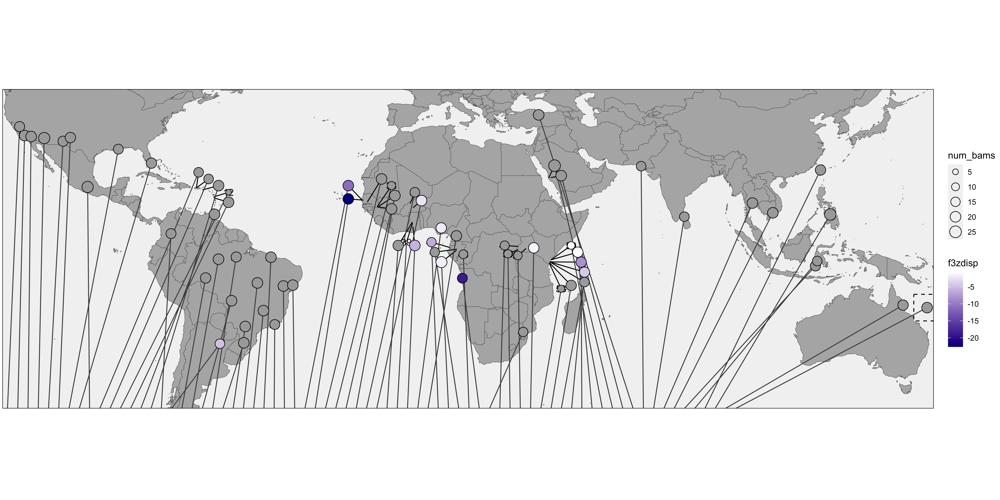


``` r
bamfile <- "../../results/Aaeg1200g_structure_data/aegy.wgs.non-AfrI3.AfrI3.unrel.n1206.bams"
structfile <- "../../results/Aaeg1200g_structure_data/aegy.wgs.non-AfrI3.AfrI3.unrel.n1206.1e6.beagle.gz.K2.mI1100.mM01.out.qopt"
structure <- cbind(read.table(bamfile,col.names="bam"),
                   read.table(structfile,col.names = c("P1","P2"))) %>%  
                mutate(sample = gsub("\\..*bam","",gsub(".*\\/","",bam,perl=T),perl=T)) %>%
                merge(read.table("../../resources/meta_Aaeg1kg_spp.txt",sep="\t",header=T)[,c("sample","pop")]) %>% 
                mutate(pop=gsub("Cuanda","Luanda",pop)) %>%
                merge(poptotals) %>% 
                mutate(country = factor(country,cntorder))

# structureM <- structure %>% pivot_longer(cols = c(P1,P2))
# ggplot(structureM,aes(x=sample,fill=name,y=value)) + 
#     geom_bar(position="stack",stat="identity") + 
#     facet_grid(. ~country, space="free_x",scales="free_x")
                

aaaprop <- structure %>% 
            dplyr::select(country,index,pop,P1,P2,f3z) %>% 
            dplyr::group_by(country,pop,index) %>%
            dplyr::summarize(aaasd = sd(P1), aaamean = mean(P1), 
                             aasd = sd(P2), aafmean = mean(P2),
                             aaaprop = sum(P1)/(sum(P2)+sum(P1)),
                             f3z = mean(f3z))
```

```
## `summarise()` has grouped output by 'country', 'pop'. You can override using the `.groups`
## argument.
```

``` r
aaaplot <- ggplot(aaaprop,aes(x=index,y="Aaa proportion",fill=aaaprop)) + 
            geom_raster() + 
            scale_fill_gradient(low="#A23D30",high="#8AC3C2",na.value="darkgrey") +
#            scale_fill_gradient(low="#fff7bc",high="#b2182b",na.value="darkgrey") +
            coord_fixed(expand=F,ratio=fxr)+
            theme(panel.border=element_rect(fill=NA, color="black"),
              panel.background=element_rect(fill='grey95', color=NA),
              panel.grid = element_blank(),
              axis.title=element_blank(),
              axis.text.x=element_blank(),
              axis.ticks=element_blank(),
              legend.position="right",
              plot.margin = unit(c(0,0,0,0), "cm"))
svglite(paste(prefix,"aaa_plot.svg",sep="_"))
aaaplot      
dev.off()
```

```
## RStudioGD 
##         2
```

``` r
poptotals <- poptotals %>% merge(aaaprop[,c("index","aaaprop","aaasd")],all.x=T)
```


``` r
poptotals
```

```
##    index            pop          search        old_label            label             state
## 1      1         Clovis          Clovis           Clovis           Clovis                CA
## 2      2     LosAngeles     Los_Angeles      Los Angeles      Los Angeles                CA
## 3      3      Coachella       Coachella Coachella Valley Coachella Valley                CA
## 4      4 MaricopaCounty Maricopa_County  Maricopa_County  Maricopa_County                AZ
## 5      5      LasCruces      Las_Cruces       Las Cruces       Las Cruces                NM
## 6      6        Roswell         Roswell          Roswell          Roswell                NM
## 7      7     NewOrleans     New_Orleans      New Orleans      New Orleans                LA
## 8      8          Miami           Miami            Miami            Miami                FL
## 9      9       Amacuzac        Amacuzac         Amacuzac         Amacuzac                  
## 10    10          Playa           Playa            Playa            Playa                  
## 11    11          Ponce           Ponce            Ponce            Ponce                  
## 12    12  NorthDominica  North_Dominica   Dominica_North   Dominica_North                  
## 13    13         Roseau          Roseau  Dominica_Roseau           Roseau                  
## 14    14       Trinidad        Trinidad         Trinidad         Trinidad                  
## 15    15          Croix           Croix        St. Croix        St. Croix                  
## 16    16           Cali            Cali             Cali             Cali                  
## 17    17       ElDorado       El_Dorado        El Dorado        El Dorado                  
## 18    18     PortoVelho     Porto_Velho      Porto Velho      Porto Velho       Rond\x99nia
## 19    19         Manaus          Manaus           Manaus           Manaus          Amazonas
## 20    20         Cuiaba          Cuiaba           Cuiabá           Cuiaba       Mato Grosso
## 21    21       Santarem        Santarem         Santarem         Santarem                  
## 22    22     PassoFundo     Passo_Fundo      Passo Fundo      Passo Fundo Rio Grande do Sul
## 23    23        Maringa         Maringa          Maringá          Maringa         Paran\x87
## 24    24         Palmas          Palmas           Palmas           Palmas         Tocantins
## 25    25   PatosdeMinas  Patos_de_Minas   Patos de Minas   Patos de Minas      Minas Gerais
## 26    26        SaoLuiz        Sao_Luiz         Sao Luiz         Sao Luiz       Maranh\x8bo
## 27    27        Paqueta         Paqueta          Paqueta          Paqueta                  
## 28    28       Jacobina        Jacobina         Jacobina         Jacobina                  
## 29    29        Lagarto         Lagarto          Lagarto          Lagarto           Sergipe
## 30    30          Thies           Thies      Dakar_Thies      Dakar_Thies                  
## 31    31          Ngoye           Ngoye            Ngoye            Ngoye                  
## 32    32         Mindin          Mindin           Mindin           Mindin                  
## 33    33        Bantata         Bantata          Bantata          Bantata                  
## 34    34           PK10            PK10             PK10             PK10                  
##        country        region num_bams num_bams_unrel        lat       long    latdisp
## 1          USA North America       18             NA  36.728860 -119.82647  36.728860
## 2          USA North America       20             NA  34.038638 -118.31205  34.038638
## 3          USA North America       20             NA  33.755818 -116.36191  33.755818
## 4          USA North America       23             NA  33.291797 -112.42915  33.291797
## 5          USA North America       18             NA  32.348944 -106.74253  32.348944
## 6          USA North America       19             NA  33.437469 -104.55625  33.437469
## 7          USA North America       17             NA  29.954935  -90.13184  29.954935
## 8          USA North America       19             NA  25.761680  -80.19179  25.761680
## 9       Mexico South America       23             NA  18.600445  -99.37008  18.600445
## 10 Puerto Rico     Caribbean       16             NA  18.333669  -66.66504  23.000000
## 11 Puerto Rico     Caribbean       16             NA  18.333669  -66.66504  21.000000
## 12    Dominica     Caribbean        5             NA  15.608100  -61.44286  17.000000
## 13    Dominica     Caribbean       20             NA  15.311378  -61.37888  14.000000
## 14    Trinidad     Caribbean       20             NA  10.375722  -61.23356  10.375722
## 15        USVI     Caribbean       20             NA  17.705845  -64.85852  19.000000
## 16    Colombia South America       17             NA   4.570868  -74.29733   4.570868
## 17   Argentina South America       16             NA -28.536275  -59.58984 -28.536275
## 18      Brazil South America       19             NA  -8.761161  -63.90043  -8.761161
## 19      Brazil South America       20             NA  -3.119028  -60.02173  -3.119028
## 20      Brazil South America       20             NA -15.601534  -56.09789 -15.601534
## 21      Brazil South America       18             NA  -2.450629  -54.70092  -2.450629
## 22      Brazil South America       20             NA -28.262260  -52.41028 -28.262260
## 23      Brazil South America       20             NA -23.347671  -51.97918 -23.347671
## 24      Brazil South America       20             NA -10.249091  -48.32429 -10.249091
## 25      Brazil South America       20             NA -18.587258  -46.51467 -18.587258
## 26      Brazil South America       20             NA  -2.521158  -44.24878  -2.521158
## 27      Brazil South America       17             NA -22.763625  -43.10836 -22.763625
## 28      Brazil South America       20             NA -11.181651  -40.51206 -11.181651
## 29      Brazil South America       20             NA -10.919582  -37.67343 -10.919582
## 30     Senegal   West Africa       20             13  14.759118  -16.93889  19.000000
## 31     Senegal   West Africa       20             19  14.639733  -16.43145  15.000000
## 32     Senegal   West Africa       20             19  14.074444  -15.28319  21.000000
## 33     Senegal   West Africa       11             11  12.675710  -12.32798  19.000000
## 34     Senegal   West Africa       20             18  12.609676  -12.24671  12.000000
##      longdisp displaced          p1         p2 chr           f3         f3sd        f3z f3sig
## 1  -119.82647     FALSE Franceville NewOrleans 123  0.032029364 9.975782e-04  32.107122 FALSE
## 2  -118.31205     FALSE Franceville NewOrleans 123  0.021239977 8.518928e-04  24.932688 FALSE
## 3  -116.36191     FALSE Franceville NewOrleans 123  0.027143374 9.189643e-04  29.536918 FALSE
## 4  -112.42915     FALSE Franceville NewOrleans 123  0.030587041 8.313018e-04  36.794147 FALSE
## 5  -106.74253     FALSE Franceville NewOrleans 123  0.019138824 8.721970e-04  21.943235 FALSE
## 6  -104.55625     FALSE Franceville NewOrleans 123  0.016740196 6.428894e-04  26.038997 FALSE
## 7   -90.13184     FALSE Franceville NewOrleans 123 -0.016666667 9.159879e-17         NA  TRUE
## 8   -80.19179     FALSE Franceville NewOrleans 123  0.024604756 1.068339e-03  23.030844 FALSE
## 9   -99.37008     FALSE Franceville NewOrleans 123  0.045253706 1.321160e-03  34.253005 FALSE
## 10  -66.00000      TRUE Franceville NewOrleans 123  0.037669280 1.415048e-03  26.620501 FALSE
## 11  -63.00000      TRUE Franceville NewOrleans 123  0.037401486 1.303972e-03  28.682730 FALSE
## 12  -57.00000      TRUE Franceville NewOrleans 123  0.056978103 1.757483e-03  32.420285 FALSE
## 13  -57.00000      TRUE Franceville NewOrleans 123  0.045246631 1.589705e-03  28.462288 FALSE
## 14  -61.23356     FALSE Franceville NewOrleans 123  0.074632175 1.838451e-03  40.595141 FALSE
## 15  -60.00000      TRUE Franceville NewOrleans 123  0.050033337 1.612308e-03  31.032123 FALSE
## 16  -74.29733     FALSE Franceville NewOrleans 123  0.072099116 1.713340e-03  42.081022 FALSE
## 17  -59.58984     FALSE Franceville NewOrleans 123 -0.004969367 1.028144e-03  -4.833337  TRUE
## 18  -63.90043     FALSE Franceville NewOrleans 123  0.050744132 1.361841e-03  37.261435 FALSE
## 19  -60.02173     FALSE Franceville NewOrleans 123  0.051691132 1.330891e-03  38.839487 FALSE
## 20  -56.09789     FALSE Franceville NewOrleans 123  0.046753146 1.237431e-03  37.782418 FALSE
## 21  -54.70092     FALSE Franceville NewOrleans 123  0.048723117 1.298537e-03  37.521539 FALSE
## 22  -52.41028     FALSE Franceville NewOrleans 123  0.015432143 1.007563e-03  15.316311 FALSE
## 23  -51.97918     FALSE Franceville NewOrleans 123  0.028497382 1.051361e-03  27.105233 FALSE
## 24  -48.32429     FALSE Franceville NewOrleans 123  0.049033200 1.261410e-03  38.871739 FALSE
## 25  -46.51467     FALSE Franceville NewOrleans 123  0.047253796 1.334517e-03  35.408901 FALSE
## 26  -44.24878     FALSE Franceville NewOrleans 123  0.062144541 1.367312e-03  45.450145 FALSE
## 27  -43.10836     FALSE Franceville NewOrleans 123  0.051825831 1.193053e-03  43.439660 FALSE
## 28  -40.51206     FALSE Franceville NewOrleans 123  0.072096861 1.519163e-03  47.458269 FALSE
## 29  -37.67343     FALSE Franceville NewOrleans 123  0.058092824 1.449676e-03  40.072964 FALSE
## 30  -21.00000      TRUE Franceville NewOrleans 123 -0.008818007 7.968922e-04 -11.065496  TRUE
## 31  -21.00000      TRUE Franceville NewOrleans 123 -0.021102468 9.310751e-04 -22.664626  TRUE
## 32  -11.00000      TRUE Franceville NewOrleans 123  0.006039943 5.302702e-04  11.390312 FALSE
## 33   -8.00000      TRUE Franceville NewOrleans 123  0.006430631 4.699271e-04  13.684317 FALSE
## 34   -8.00000      TRUE Franceville NewOrleans 123  0.008942281 4.466122e-04  20.022475 FALSE
##                                      set                 parent   sig    f3zdisp     winpos
## 1          Clovis/Franceville/NewOrleans Franceville/NewOrleans FALSE         NA -123.45833
## 2      LosAngeles/Franceville/NewOrleans Franceville/NewOrleans FALSE         NA -120.37500
## 3       Coachella/Franceville/NewOrleans Franceville/NewOrleans FALSE         NA -117.29167
## 4  MaricopaCounty/Franceville/NewOrleans Franceville/NewOrleans FALSE         NA -114.20833
## 5       LasCruces/Franceville/NewOrleans Franceville/NewOrleans FALSE         NA -111.12500
## 6         Roswell/Franceville/NewOrleans Franceville/NewOrleans FALSE         NA -108.04167
## 7      NewOrleans/Franceville/NewOrleans Franceville/NewOrleans    NA         NA -104.95833
## 8           Miami/Franceville/NewOrleans Franceville/NewOrleans FALSE         NA -101.87500
## 9        Amacuzac/Franceville/NewOrleans Franceville/NewOrleans FALSE         NA  -98.79167
## 10          Playa/Franceville/NewOrleans Franceville/NewOrleans FALSE         NA  -95.70833
## 11          Ponce/Franceville/NewOrleans Franceville/NewOrleans FALSE         NA  -92.62500
## 12  NorthDominica/Franceville/NewOrleans Franceville/NewOrleans FALSE         NA  -89.54167
## 13         Roseau/Franceville/NewOrleans Franceville/NewOrleans FALSE         NA  -86.45833
## 14       Trinidad/Franceville/NewOrleans Franceville/NewOrleans FALSE         NA  -83.37500
## 15          Croix/Franceville/NewOrleans Franceville/NewOrleans FALSE         NA  -80.29167
## 16           Cali/Franceville/NewOrleans Franceville/NewOrleans FALSE         NA  -77.20833
## 17       ElDorado/Franceville/NewOrleans Franceville/NewOrleans  TRUE  -4.833337  -74.12500
## 18     PortoVelho/Franceville/NewOrleans Franceville/NewOrleans FALSE         NA  -71.04167
## 19         Manaus/Franceville/NewOrleans Franceville/NewOrleans FALSE         NA  -67.95833
## 20         Cuiaba/Franceville/NewOrleans Franceville/NewOrleans FALSE         NA  -64.87500
## 21       Santarem/Franceville/NewOrleans Franceville/NewOrleans FALSE         NA  -61.79167
## 22     PassoFundo/Franceville/NewOrleans Franceville/NewOrleans FALSE         NA  -58.70833
## 23        Maringa/Franceville/NewOrleans Franceville/NewOrleans FALSE         NA  -55.62500
## 24         Palmas/Franceville/NewOrleans Franceville/NewOrleans FALSE         NA  -52.54167
## 25   PatosdeMinas/Franceville/NewOrleans Franceville/NewOrleans FALSE         NA  -49.45833
## 26        SaoLuiz/Franceville/NewOrleans Franceville/NewOrleans FALSE         NA  -46.37500
## 27        Paqueta/Franceville/NewOrleans Franceville/NewOrleans FALSE         NA  -43.29167
## 28       Jacobina/Franceville/NewOrleans Franceville/NewOrleans FALSE         NA  -40.20833
## 29        Lagarto/Franceville/NewOrleans Franceville/NewOrleans FALSE         NA  -37.12500
## 30          Thies/Franceville/NewOrleans Franceville/NewOrleans  TRUE -11.065496  -34.04167
## 31          Ngoye/Franceville/NewOrleans Franceville/NewOrleans  TRUE -22.664626  -30.95833
## 32         Mindin/Franceville/NewOrleans Franceville/NewOrleans FALSE         NA  -27.87500
## 33        Bantata/Franceville/NewOrleans Franceville/NewOrleans FALSE         NA  -24.79167
## 34           PK10/Franceville/NewOrleans Franceville/NewOrleans FALSE         NA  -21.70833
##         aaaprop        aaasd
## 1  0.8614203034 0.0295426098
## 2  0.9159044830 0.0348837444
## 3  0.9331541005 0.0183514848
## 4  0.9140635627 0.0166228802
## 5  0.8846886883 0.0386019066
## 6  0.8851002674 0.0320628938
## 7  0.8750317869 0.0212414688
## 8  0.9433785377 0.0168253667
## 9  0.9725498849 0.0106344005
## 10 0.9861835557 0.0055490911
## 11 0.9828943182 0.0081909834
## 12 0.9693995498 0.0065330441
## 13 0.9718975949 0.0077011306
## 14 0.9948631490 0.0041614238
## 15 0.9903950572 0.0025996525
## 16 0.9972222297 0.0030151529
## 17 0.3944011405 0.0324940759
## 18 0.9808892139 0.0211947852
## 19 0.9865853210 0.0162526602
## 20 0.9755207444 0.0225149307
## 21 0.9894274301 0.0122128279
## 22 0.7883023796 0.0463191651
## 23 0.9034092520 0.0349495438
## 24 0.9858173768 0.0163930139
## 25 0.9700592251 0.0215372458
## 26 0.9973832486 0.0045253455
## 27 0.9798392235 0.0085489774
## 28 0.9991830532 0.0022028221
## 29 0.9984316301 0.0034147952
## 30 0.1684733308 0.0256710103
## 31 0.3017599125 0.0805625706
## 32 0.0113132908 0.0292987305
## 33 0.0033486369 0.0111061688
## 34 0.0001192788 0.0004917949
##  [ reached 'max' / getOption("max.print") -- omitted 38 rows ]
```

``` r
poptotals[poptotals$country %in%  c("Senegal","Burkina Faso","Ghana","Nigeria", "Cameroon","Gabon","Angola","South Africa", "Uganda","Kenya"),c("country","pop","aaasd","aaaprop","region")]
```

```
##         country         pop        aaasd      aaaprop      region
## 30      Senegal       Thies 2.567101e-02 0.1684733308 West Africa
## 31      Senegal       Ngoye 8.056257e-02 0.3017599125 West Africa
## 32      Senegal      Mindin 2.929873e-02 0.0113132908 West Africa
## 33      Senegal     Bantata 1.110617e-02 0.0033486369 West Africa
## 34      Senegal        PK10 4.917949e-04 0.0001192788 West Africa
## 35      Senegal    Kedougou 1.681262e-02 0.0047288050 West Africa
## 36 Burkina Faso  Ouahigouya 5.274951e-05 0.0000140989 West Africa
## 37 Burkina Faso       Ouaga 2.088944e-02 0.0621897010 West Africa
## 38        Ghana    Kintampo 1.798971e-02 0.0155420929 West Africa
## 39        Ghana     Boabeng 3.756603e-03 0.0026563208 West Africa
## 40        Ghana      Kumasi 2.805630e-02 0.0450171587 West Africa
## 41      Nigeria        Awka 4.026428e-02 0.0216378945 West Africa
## 42     Cameroon       YAOMO 1.792987e-02 0.0610173110 West Africa
## 43        Gabon  Libreville 1.604951e-02 0.0592383379 West Africa
## 44        Gabon      LaLope 3.661032e-03 0.0019795573 West Africa
## 45        Gabon LopeVillage 0.000000e+00 0.0000000010 West Africa
## 46        Gabon Franceville 0.000000e+00 0.0000000010 West Africa
## 47       Angola      Luanda 5.493465e-02 0.4683924568 West Africa
## 48 South Africa     Skukusa 4.913314e-03 0.0108056332 East Africa
## 49       Uganda  Bundibugyo 0.000000e+00 0.0000000010 East Africa
## 50       Uganda   Kichwamba 0.000000e+00 0.0000000010 East Africa
## 51       Uganda     Entebbe 0.000000e+00 0.0000000010 East Africa
## 52        Kenya    Kakamega 2.312790e-02 0.0184045441 East Africa
## 53        Kenya ShimbaHills 2.816266e-02 0.0606527769 East Africa
## 54        Kenya       Kwale 4.557432e-02 0.1033244326 East Africa
## 55        Kenya   Rabai2009 3.038668e-01 0.5878844780 East Africa
## 56        Kenya   Rabai2017 3.764706e-02 0.1192801665 East Africa
## 57        Kenya    KayaBomu 4.986359e-02 0.1339282038 East Africa
## 58        Kenya     Arabuko 3.721000e-02 0.0957689453 East Africa
## 59        Kenya       Ganda 1.668985e-02 0.1065372902 East Africa
```

``` r
aaabar <- ggplot(poptotals,aes(x=pop,group=region,fill=region,y=aaaprop)) + 
  geom_bar(stat="identity") + 
  theme(axis.text.x=element_text(angle=90,hjust=1),
        legend.position="bottom")+
  facet_grid(. ~ region,scales="free_x",space="free_x")
aaabar 
```

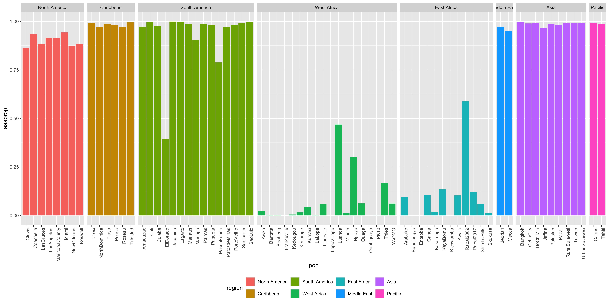


``` r
aaamap <- ggplot(poptotals,aes(x=longdisp, y=latdisp, label=pop,xend=long, yend=lat)) +
    geom_polygon(data = world, aes(x=long, y=lat, group=group), fill='grey70',color="grey40",size=0.2,inherit.aes=F) +
    geom_segment(data=subset(poptotals,displaced)) +
    geom_text(data=poptotals, aes(label=index)) +
    geom_rect(data=subset(poptotals,pop=="Tahiti"), 
              aes(ymin=latdisp-4,ymax=latdisp+4,
                  xmin=longdisp-4,xmax=longdisp+4),
              fill="grey95",color="black",linetype="dashed",) +
    geom_segment(aes(x=longdisp, y=latdisp,xend=winpos, yend=-48),color="grey30") +
    geom_point(data=poptotals, aes(fill=aaaprop,size=num_bams), shape=21) +
    coord_fixed(ylim=c(-48,48),xlim=c(longcut,longcut+maplen),expand = F)+
    scale_fill_gradient(low="#A23D30",high="#8AC3C2",na.value="darkgrey") +
    #scale_fill_gradient(low="#fff7bc",high="#b2182b",na.value="darkgrey") +
    #scale_fill_gradient(low="#2166ac",high="#b2182b",na.value="darkgrey") +
    #scale_fill_gradient2(low="#2166ac",mid="white",high="#b2182b",midpoint = 0.5,na.value="darkgrey") +
    theme(panel.border=element_rect(fill=NA, color="black"),
          panel.background=element_rect(fill='grey95', color=NA),
          panel.grid = element_blank(),
          axis.title=element_blank(),
          axis.text=element_blank(),
          axis.ticks=element_blank(),
          legend.position="bottom",
              plot.margin = unit(c(0,0,0,0), "cm"))
svglite(paste(prefix,"aaa_map.svg",sep="_"),width=12,height=10)
aaamap
dev.off()
```

```
## RStudioGD 
##         2
```


``` r
resist <- read.table("../230816_kdrhaps_3/resistance_locus_prevalence_per_pop.txt",header=T,sep="\t") %>% 
            merge(poptotals[c("label","pop","index","lat","long","longdisp","latdisp","num_bams")],all.x=T) %>%
            pivot_longer(cols=c(V1016G,V1016I,F1534C,all),names_to = "locus",values_to="prevalence") %>%
            mutate(locus = factor(locus,levels=c("V1016G","V1016I","F1534C","all")))
```


``` r
kdrmap <- ggplot(poptotals,aes(x=longdisp, y=latdisp, label=pop,xend=long, yend=lat)) +
    geom_polygon(data = world, aes(x=long, y=lat, group=group), fill='grey70',color="grey40",size=0.2,inherit.aes=F) +
    geom_segment(data=subset(poptotals,displaced)) +
    geom_text(data=poptotals, aes(label=index)) +
    geom_rect(data=subset(poptotals,pop=="Tahiti"), 
              aes(ymin=latdisp-4,ymax=latdisp+4,
                  xmin=longdisp-4,xmax=longdisp+4),
              fill="grey95",color="black",linetype="dashed",) +
    geom_segment(aes(x=longdisp, y=latdisp,xend=winpos, yend=-48),color="grey30") +
    geom_point(data=subset(resist,locus=="F1534C"),aes(fill=prevalence,size=num_bams), shape=21) +
    coord_fixed(ylim=c(-48,48),xlim=c(longcut,longcut+maplen),expand = F)+
    scale_fill_gradient(low="white",high="#b2182b",na.value="darkgrey",limits=c(0,1),name="F1534C") +
    #scale_fill_gradient2(low="#2166ac",mid="white",high="#b2182b",midpoint = 0.5,na.value="darkgrey") +
    theme(panel.border=element_rect(fill=NA, color="black"),
          panel.background=element_rect(fill='grey95', color=NA),
          panel.grid = element_blank(),
          axis.title=element_blank(),
          axis.text=element_blank(),
          axis.ticks=element_blank(),
          legend.position="bottom",
              plot.margin = unit(c(0,0,0,0), "cm"))
kdrmap
```

```
## Warning: Removed 1 row containing missing values or values outside the scale range
## (`geom_point()`).
```

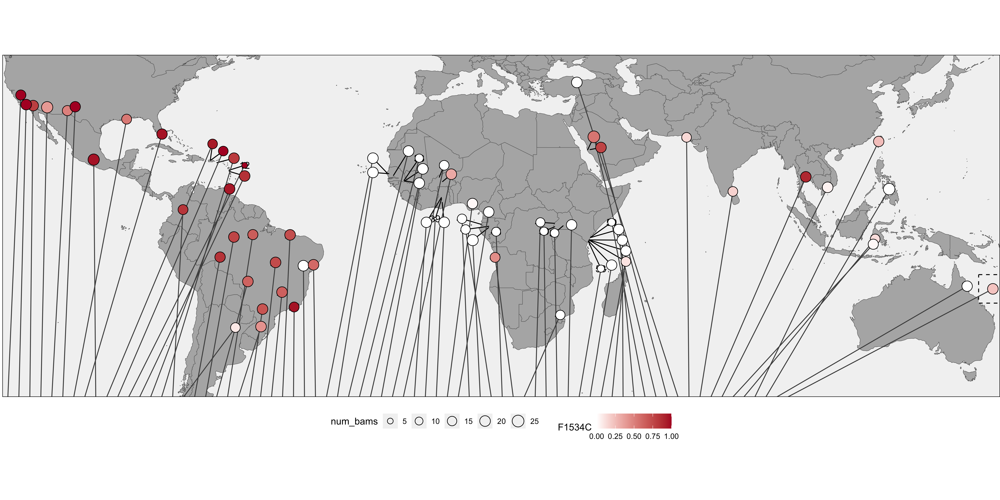

``` r
svglite(paste(prefix,"kdr_map.svg",sep="_"),width=12,height=10)
kdrmap
```

```
## Warning: Removed 1 row containing missing values or values outside the scale range
## (`geom_point()`).
```

``` r
dev.off()
```

```
## RStudioGD 
##         2
```


``` r
sentotals = subset(resist,locus=="F1534C" & country=="Senegal")

sentotals$longdisp = sentotals$long
sentotals$latdisp = sentotals$lat

sentotals$label[sentotals$label=="Dakar_Thies"] <- "Thies"
#sentotals[sentotals$label=="Bantata",c("longdisp","latdisp")] <- #sentotals[sentotals$label=="Bantata",c("long","lat")]+c(-0.5,0.7)

sentotals[sentotals$label=="PK10",c("longdisp","latdisp")] <- sentotals[sentotals$label=="PK10",c("long","lat")]+c(-0,0.6)

sentotals[sentotals$label=="Kedougou",c("longdisp","latdisp")] <- sentotals[sentotals$label=="Kedougou",c("long","lat")]+c(0.15,1.0)

kdrsenmap <- ggplot(sentotals,aes(x=longdisp, y=latdisp, label=pop,xend=long,yend=lat)) +
    geom_polygon(data = world, aes(x=long, y=lat, group=group), fill='grey70',color="grey40",size=0.2,inherit.aes=F) +
    geom_segment() +
    geom_point(data=subset(sentotals,locus=="F1534C"),aes(fill=prevalence,size=num_bams), shape=21) +
    geom_text(data=subset(sentotals,label %in% c("Thies","Mindin","Bantata","PK10","Kedougou")), aes(label=label),hjust=1.4) +
    geom_text(data=subset(sentotals,label %in% c("Ngoye")), aes(label=label),hjust=-0.4) +
    coord_fixed(xlim =c(-18,-11),ylim=c(12,17), expand = F)+
    scale_fill_gradient(low="white",high="#b2182b",na.value="darkgrey",limits=c(0,1)) +
    #scale_fill_gradient2(low="#2166ac",mid="white",high="#b2182b",midpoint = 0.5,na.value="darkgrey") +
    theme(panel.border=element_rect(fill=NA, color="black"),
          panel.background=element_rect(fill='grey95', color=NA),
          panel.grid = element_blank(),
          axis.title=element_blank(),
          axis.text=element_blank(),
          axis.ticks=element_blank(),
          legend.position="bottom",
              plot.margin = unit(c(0,0,0,0), "cm"))
kdrsenmap
```

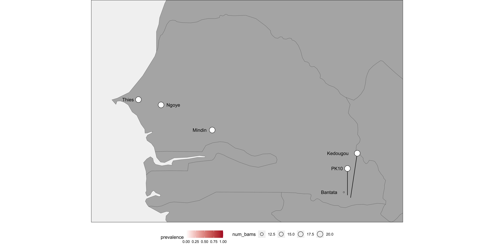

``` r
svglite(paste(prefix,"kdr_sen_map.svg",sep="_"),width=4,height=4)
kdrsenmap
dev.off()
```

```
## RStudioGD 
##         2
```


``` r
fxr=2


f3plot <- ggplot(poptotals,aes(x=index,y="admixture (F3)",fill=f3zdisp)) + 
            geom_raster() + 
            scale_fill_gradient(low="#b2182b",high="white",na.value="grey") + 
            coord_fixed(expand=F,ratio=fxr)+
            theme(panel.border=element_rect(fill=NA, color="black"),
              panel.background=element_rect(fill='grey95', color=NA),
              panel.grid = element_blank(),
              axis.title=element_blank(),
              axis.text.x=element_blank(),
              axis.ticks=element_blank(),
              legend.position="right",
              plot.margin = unit(c(0,0,0,0), "cm"))
f3plot      
```

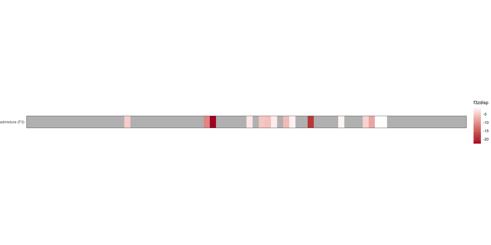

``` r
svglite(paste(prefix,"admixture_plot.svg",sep="_"),width=12)
f3plot
dev.off()
```

```
## RStudioGD 
##         2
```


``` r
resplot <- ggplot(resist,aes(x=index,y=locus,fill=prevalence)) + geom_raster() + 
          scale_fill_gradient(high="darkblue",low="white",na.value="grey") + 
          coord_fixed(expand=F,ratio=fxr)+
          theme(panel.border=element_rect(fill=NA, color="black"),
            panel.background=element_rect(fill='grey95', color=NA),
            panel.grid = element_blank(),
            axis.title=element_blank(),
            axis.text.x=element_blank(),
            axis.ticks=element_blank(),
            legend.position="right",
              plot.margin = unit(c(0,0,0,0), "cm"))
resplot
```

```
## Warning: Removed 4 rows containing missing values or values outside the scale range
## (`geom_raster()`).
```

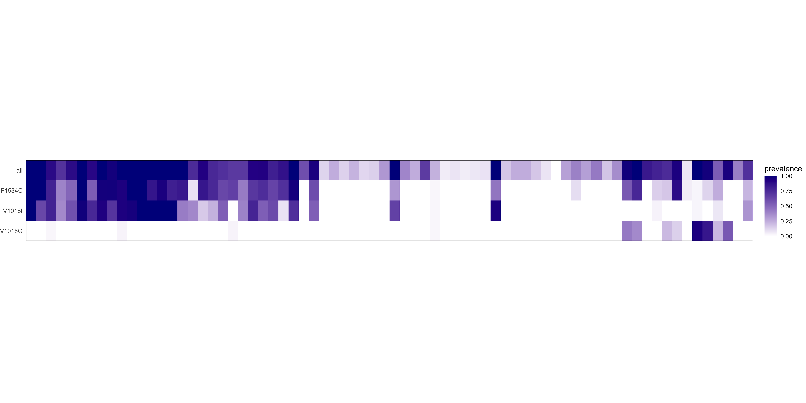

``` r
svglite(paste(prefix,"resistance_plot.svg",sep="_"),width=10)
resplot
```

```
## Warning: Removed 4 rows containing missing values or values outside the scale range
## (`geom_raster()`).
```

``` r
dev.off()
```

```
## RStudioGD 
##         2
```


``` r
outbreaks <- read.table("DENV_outbreaks_gainor_22.txt",header=T,sep="\t",
                        )%>% 
            merge(poptotals[c("country","pop","index")],all.y=T)

outbreaksC <- outbreaks %>% filter(!is.na(no_outbreaks)) %>%
                  dplyr::group_by(country) %>% 
                  dplyr::summarise(no_outbreaks = mean(no_outbreaks),
                                    mindex = min(index)-0.5,
                                    maxdex = max(index)+0.5,
                                    n=n())
outcols = c("0"="#ffffff",
  "1"="#fed976",
  "2"="#fd8d3c",
  "3"="#fc4e2a")


outplot <- ggplot(outbreaks,aes(x=index,y="Dengue outbreaks",fill=factor(no_outbreaks), group=country)) +   
          geom_tile() + 
          geom_rect(data=outbreaksC,aes(xmin=mindex,xmax=maxdex,ymin=0.5,ymax=1.5),inherit.aes=F,color="black",fill=NA) + 
          scale_fill_manual("outbreaks",values=outcols,na.value=NA) + 
          coord_fixed(expand=F,ratio=fxr)+
          theme(
            panel.background=element_rect(fill='white', color=NA),
            panel.grid = element_blank(),
            axis.title=element_blank(),
            axis.text.x=element_blank(),
            axis.ticks=element_blank(),
            legend.position="right",
              plot.margin = unit(c(0,0,0,0), "cm"))
outplot
```

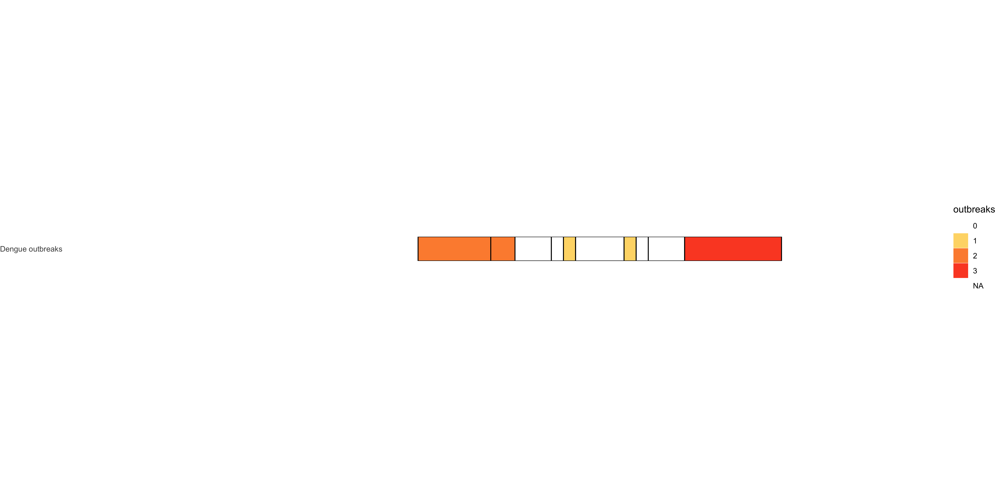

``` r
svglite(paste(prefix,"outbreaks_plot.svg",sep="_"))
outplot
dev.off()
```

```
## RStudioGD 
##         2
```


``` r
cdcriskall <- read.table("CDC_DENV_risk_profile.tsv",header=T,sep="\t")
cdcriskall$country[cdcriskall$country == "United Republic of Tanzania"] <- "Tanzania"

cdcriskall$country[cdcriskall$country == "Congo (Democratic republic of)"] <- "Democratic Republic of the Congo"
cdcriskall$country[cdcriskall$country == "Congo"] <- "Republic of Congo"
cdcrisk <- cdcriskall %>% 
            merge(poptotals[c("country","pop","index")],all.y=T)


cdcriskman <- read.table("CDC_DENV_risk_profile_manual.tsv",header=T,sep="\t") %>% column_to_rownames(var = "pop")

snames = cdcrisk$pop[cdcrisk$pop %in% rownames(cdcriskman)]
cdcrisk$risk[cdcrisk$pop %in% snames] <- cdcriskman[snames,"risk"]

cdcrisksC <- cdcrisk %>% filter(!is.na(risk)) %>%
                  dplyr::group_by(country) %>%
                  dplyr::summarise(
                                    mindex = min(index)-0.5,
                                    maxdex = max(index)+0.5,
                                    n=n())

cdcplot <- ggplot(cdcrisk,aes(x=index,y="CDC dengue risk",fill=risk, group=country)) +   
          geom_tile() + 
           geom_rect(data=cdcrisksC,aes(xmin=mindex,xmax=maxdex,ymin=0.5,ymax=1.5),inherit.aes=F,color="black",fill=NA) + 
          scale_fill_manual(values=c("Frequent/Continuous"="#fc4e2a",
                                     "Sporadic/Uncertain"="#fed976")) + 
          coord_fixed(expand=F,ratio=fxr)+
          theme(
            panel.background=element_rect(fill='white', color=NA),
            panel.grid = element_blank(),
            axis.title=element_blank(),
            axis.text.x=element_blank(),
            axis.ticks=element_blank(),
            legend.position="right",
              plot.margin = unit(c(0,0,0,0), "cm"))
cdcplot
```

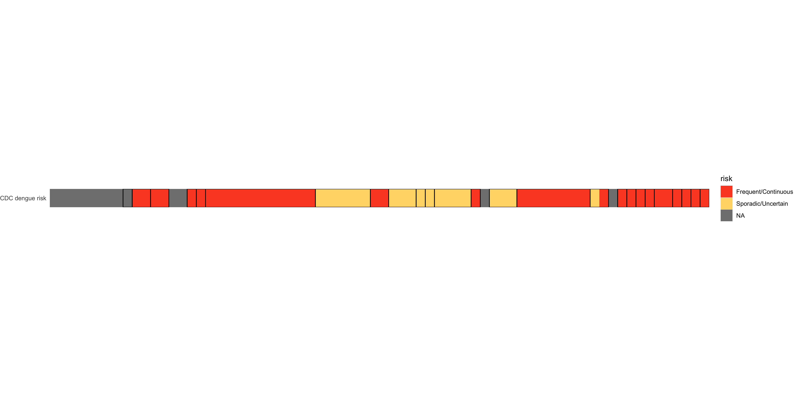

``` r
svglite(paste(prefix,"cdcrisk_plot.svg",sep="_"))
cdcplot
dev.off()
```

```
## RStudioGD 
##         2
```


``` r
samplehaps <- read.table("../230816_kdrhaps_3/sample_haplotype_mapping.txt",sep="\t",header=T)
samplehaps$displayhap <- samplehaps$hap

#manual merges of minor haps:
merges <- list()

#merges[["H001"]] <- c("H038","H035","H034","H026","H017","H012","H037","H011")
merges[["H001s"]] <- c("H001","H010","H034","H017")
merges[["H001r"]] <- c("H038","H035","H026",
                      "H012","H037","H011")
merges[["H002"]] <- c("H020","H018","H021","H045","H047","H033","H048","H025")
merges[["H003"]] <- c("H040","H027","H015","H024","H014","H022","H032","H013")
merges[["H004"]] <- c("H031","H042","H046")
merges[["H005"]] <- c()
merges[["H006"]] <- c("H030","H029","H028","H019")
merges[["H007"]] <- c("H036","H039")
merges[["H008"]] <- c("H043","H044")
merges[["H009"]] <- c()
merges[["H010r"]] <- c("H041","H016","H023")

for(H in names(merges)) {
  write(H,stderr())
  samplehaps$displayhap[samplehaps$displayhap %in% merges[[H]]] <- H
}

african=c("H009") 
asian=c("H001r","H004","H003","H006") 
american=c("H010r","H008","H007","H005","H002") 
horder = c("H001s",african,asian,american)


library(RColorBrewer)  
cols = c(
  c("#ffffe5","#fec44f"),
  brewer.pal(length(asian)+1,"Blues")[2:(length(asian)+1)],
  #c("#3182bd"),
  brewer.pal(length(american)+1,"Reds")[2:(length(american)+1)]
  )
  
names(cols) = horder
samplehaps$displayhap <- factor(samplehaps$displayhap,levels=rev(horder))
cols
```

```
##     H001s      H009     H001r      H004      H003      H006     H010r      H008      H007 
## "#ffffe5" "#fec44f" "#BDD7E7" "#6BAED6" "#3182BD" "#08519C" "#FCBBA1" "#FC9272" "#FB6A4A" 
##      H005      H002 
## "#DE2D26" "#A50F15"
```

``` r
hapcntcount <- samplehaps %>% dplyr::select("sample","country","hap","pop","displayhap") %>% 
                    group_by(pop,displayhap) %>% 
                    dplyr::summarise(hapcount=n()) %>%
                    merge(poptotals[,c("country","index","pop")])
```

```
## `summarise()` has grouped output by 'pop'. You can override using the `.groups` argument.
```

``` r
hapcntcount$country <- factor(hapcntcount$country,levels=cntorder)


happlot <- ggplot(hapcntcount,aes(x=index,y=hapcount,fill=displayhap)) + 
  geom_bar(stat="identity",position = "fill") +
  scale_fill_manual(values=cols)+
  scale_x_continuous(expand = c(0,0))+
  scale_y_continuous(expand = c(0,0))+
  theme(panel.border=element_rect(fill=NA, color="black"),
              panel.grid = element_blank(),
              axis.title=element_blank(),
              axis.text.x=element_blank(),
              axis.ticks=element_blank(),
              legend.position="right",
              plot.margin = unit(c(0,0,0,0), "cm"))

happlot 
```

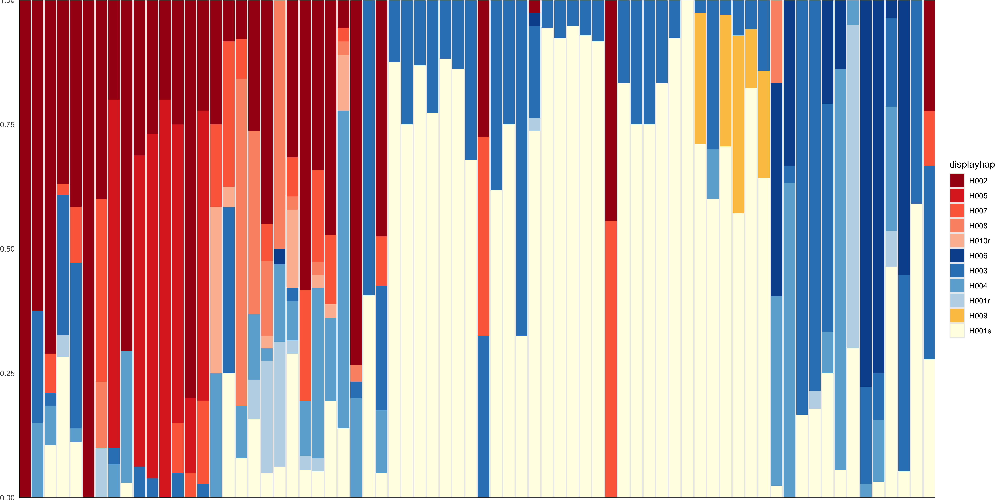

``` r
svglite(paste(prefix,"haplotype_bar_plot.svg",sep="_"))
happlot
dev.off()
```

```
## RStudioGD 
##         2
```


``` r
noleg <- theme(legend.position="none")

f3mapPW <- f3map + noleg
aaamapPW <- aaamap + noleg
f3plotPW <- f3plot + noleg
aaaplotPW <- aaaplot + noleg
resplotPW <- resplot + noleg
happlotPW <- happlot + noleg
outplotPW <- outplot + noleg
cdcplotPW <- cdcplot + noleg


(aaamapPW / ((
            ((aaaplotPW / f3plotPW / outplotPW /cdcplotPW / resplotPW / happlotPW) + plot_layout(heights=c(1,1,1,1,2,6))) 
            | plot_spacer()
            ) + plot_layout(widths=c(8,2)))
) + plot_layout(heights=c(4,6))
```

```
## Warning: Removed 4 rows containing missing values or values outside the scale range
## (`geom_raster()`).
```

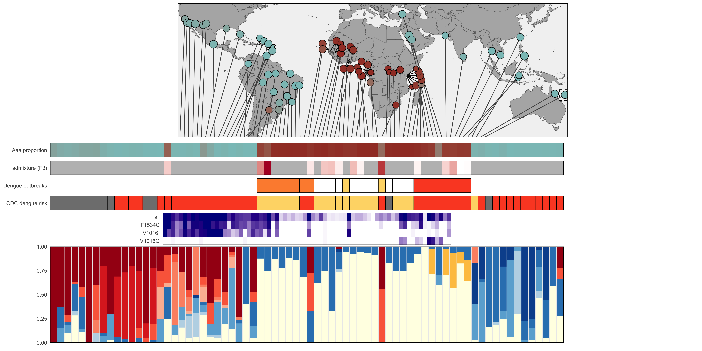

``` r
svglite(paste(prefix,"combined_plot.svg",sep="_"),width=12,height=10)
(aaamapPW / ((
            ((f3plotPW / outplotPW /cdcplotPW / resplotPW / happlotPW) + plot_layout(heights=c(1,1,1,2,6))) 
            | plot_spacer()
            ) + plot_layout(widths=c(8,2)))
) + plot_layout(heights=c(4,6))
```

```
## Warning: Removed 4 rows containing missing values or values outside the scale range
## (`geom_raster()`).
```

``` r
dev.off()
```

```
## RStudioGD 
##         2
```

``` r
# admdes <- "11111
# 11111
# 11111
# 11111
# 22225
# 33335
# 33335
# 44445
# 44445
# 44445"
# 
# f3map + f3plot + resplot + happlot + guide_area() + plot_layout(design=admdes,guides="collect")
```


``` r
library("rnaturalearth")
library("geosphere")
library("sf")

coast <- ne_coastline(returnclass = "sf",scale = "small")

africapoptotals <- poptotals[poptotals$region %in% c("East Africa","West Africa"),]

africasf <- poptotals[poptotals$region %in% c("East Africa","West Africa"),] %>% 
              st_as_sf(coords = c('long','lat')) %>% 
              st_set_crs(4326)

# use dist2Line from geosphere - only works for WGS84 
#data
# dist <- geosphere::dist2Line(p = st_coordinates(senegalsf), 
#                          line = coast)

dist <- geosphere::dist2Line(p = st_coordinates(africasf), 
                         line = st_coordinates(coast)[,c(1,2)])
```

```
## Warning in .pointsToMatrix(line): longitude > 180
```

```
## Warning in .pointsToMatrix(p1): longitude > 180
```

```
## Warning in .pointsToMatrix(p2): longitude > 180
```

```
## Warning in .pointsToMatrix(p1): longitude > 180
```

```
## Warning in .pointsToMatrix(p2): longitude > 180
```

```
## Warning in .pointsToMatrix(p1): longitude > 180
```

```
## Warning in .pointsToMatrix(p2): longitude > 180
```

```
## Warning in .pointsToMatrix(p1): longitude > 180
## Warning in .pointsToMatrix(p1): longitude > 180
## Warning in .pointsToMatrix(p1): longitude > 180
```

```
## Warning in .pointsToMatrix(p2): longitude > 180
```

```
## Warning in .pointsToMatrix(p1): longitude > 180
```

```
## Warning in .pointsToMatrix(p2): longitude > 180
```

```
## Warning in .pointsToMatrix(p1): longitude > 180
## Warning in .pointsToMatrix(p1): longitude > 180
## Warning in .pointsToMatrix(p1): longitude > 180
```

```
## Warning in .pointsToMatrix(p2): longitude > 180
```

```
## Warning in .pointsToMatrix(p1): longitude > 180
```

```
## Warning in .pointsToMatrix(p2): longitude > 180
```

```
## Warning in .pointsToMatrix(p1): longitude > 180
## Warning in .pointsToMatrix(p1): longitude > 180
```

```
## Warning in .pointsToMatrix(p2): longitude > 180
```

```
## Warning in .pointsToMatrix(p1): longitude > 180
```

```
## Warning in .pointsToMatrix(p2): longitude > 180
```

```
## Warning in .pointsToMatrix(p1): longitude > 180
```

```
## Warning in .pointsToMatrix(p2): longitude > 180
```

```
## Warning in .pointsToMatrix(p1): longitude > 180
## Warning in .pointsToMatrix(p1): longitude > 180
## Warning in .pointsToMatrix(p1): longitude > 180
```

```
## Warning in .pointsToMatrix(p2): longitude > 180
```

```
## Warning in .pointsToMatrix(p1): longitude > 180
```

```
## Warning in .pointsToMatrix(p2): longitude > 180
```

```
## Warning in .pointsToMatrix(p1): longitude > 180
## Warning in .pointsToMatrix(p1): longitude > 180
## Warning in .pointsToMatrix(p1): longitude > 180
```

```
## Warning in .pointsToMatrix(p2): longitude > 180
```

```
## Warning in .pointsToMatrix(p1): longitude > 180
```

```
## Warning in .pointsToMatrix(p2): longitude > 180
```

```
## Warning in .pointsToMatrix(p1): longitude > 180
## Warning in .pointsToMatrix(p1): longitude > 180
```

```
## Warning in .pointsToMatrix(p2): longitude > 180
```

```
## Warning in .pointsToMatrix(p1): longitude > 180
```

```
## Warning in .pointsToMatrix(p2): longitude > 180
```

```
## Warning in .pointsToMatrix(p1): longitude > 180
```

```
## Warning in .pointsToMatrix(p2): longitude > 180
```

```
## Warning in .pointsToMatrix(p1): longitude > 180
## Warning in .pointsToMatrix(p1): longitude > 180
## Warning in .pointsToMatrix(p1): longitude > 180
```

```
## Warning in .pointsToMatrix(p2): longitude > 180
```

```
## Warning in .pointsToMatrix(p1): longitude > 180
```

```
## Warning in .pointsToMatrix(p2): longitude > 180
```

```
## Warning in .pointsToMatrix(p1): longitude > 180
## Warning in .pointsToMatrix(p1): longitude > 180
## Warning in .pointsToMatrix(p1): longitude > 180
```

```
## Warning in .pointsToMatrix(p2): longitude > 180
```

```
## Warning in .pointsToMatrix(p1): longitude > 180
```

```
## Warning in .pointsToMatrix(p2): longitude > 180
```

```
## Warning in .pointsToMatrix(p1): longitude > 180
## Warning in .pointsToMatrix(p1): longitude > 180
```

```
## Warning in .pointsToMatrix(p2): longitude > 180
```

```
## Warning in .pointsToMatrix(p1): longitude > 180
```

```
## Warning in .pointsToMatrix(p2): longitude > 180
```

```
## Warning in .pointsToMatrix(p1): longitude > 180
```

```
## Warning in .pointsToMatrix(p2): longitude > 180
```

```
## Warning in .pointsToMatrix(p1): longitude > 180
## Warning in .pointsToMatrix(p1): longitude > 180
## Warning in .pointsToMatrix(p1): longitude > 180
```

```
## Warning in .pointsToMatrix(p2): longitude > 180
```

```
## Warning in .pointsToMatrix(p1): longitude > 180
```

```
## Warning in .pointsToMatrix(p2): longitude > 180
```

```
## Warning in .pointsToMatrix(p1): longitude > 180
## Warning in .pointsToMatrix(p1): longitude > 180
## Warning in .pointsToMatrix(p1): longitude > 180
```

```
## Warning in .pointsToMatrix(p2): longitude > 180
```

```
## Warning in .pointsToMatrix(p1): longitude > 180
```

```
## Warning in .pointsToMatrix(p2): longitude > 180
```

```
## Warning in .pointsToMatrix(p1): longitude > 180
## Warning in .pointsToMatrix(p1): longitude > 180
```

```
## Warning in .pointsToMatrix(p2): longitude > 180
```

```
## Warning in .pointsToMatrix(p1): longitude > 180
```

```
## Warning in .pointsToMatrix(p2): longitude > 180
```

```
## Warning in .pointsToMatrix(p1): longitude > 180
```

```
## Warning in .pointsToMatrix(p2): longitude > 180
```

```
## Warning in .pointsToMatrix(p1): longitude > 180
## Warning in .pointsToMatrix(p1): longitude > 180
## Warning in .pointsToMatrix(p1): longitude > 180
```

```
## Warning in .pointsToMatrix(p2): longitude > 180
```

```
## Warning in .pointsToMatrix(p1): longitude > 180
```

```
## Warning in .pointsToMatrix(p2): longitude > 180
```

```
## Warning in .pointsToMatrix(p1): longitude > 180
## Warning in .pointsToMatrix(p1): longitude > 180
## Warning in .pointsToMatrix(p1): longitude > 180
```

```
## Warning in .pointsToMatrix(p2): longitude > 180
```

```
## Warning in .pointsToMatrix(p1): longitude > 180
```

```
## Warning in .pointsToMatrix(p2): longitude > 180
```

```
## Warning in .pointsToMatrix(p1): longitude > 180
## Warning in .pointsToMatrix(p1): longitude > 180
```

```
## Warning in .pointsToMatrix(p2): longitude > 180
```

```
## Warning in .pointsToMatrix(p1): longitude > 180
```

```
## Warning in .pointsToMatrix(p2): longitude > 180
```

```
## Warning in .pointsToMatrix(p1): longitude > 180
```

```
## Warning in .pointsToMatrix(p2): longitude > 180
```

```
## Warning in .pointsToMatrix(p1): longitude > 180
## Warning in .pointsToMatrix(p1): longitude > 180
## Warning in .pointsToMatrix(p1): longitude > 180
```

```
## Warning in .pointsToMatrix(p2): longitude > 180
```

```
## Warning in .pointsToMatrix(p1): longitude > 180
```

```
## Warning in .pointsToMatrix(p2): longitude > 180
```

```
## Warning in .pointsToMatrix(p1): longitude > 180
## Warning in .pointsToMatrix(p1): longitude > 180
## Warning in .pointsToMatrix(p1): longitude > 180
```

```
## Warning in .pointsToMatrix(p2): longitude > 180
```

```
## Warning in .pointsToMatrix(p1): longitude > 180
```

```
## Warning in .pointsToMatrix(p2): longitude > 180
```

```
## Warning in .pointsToMatrix(p1): longitude > 180
## Warning in .pointsToMatrix(p1): longitude > 180
```

```
## Warning in .pointsToMatrix(p2): longitude > 180
```

```
## Warning in .pointsToMatrix(p1): longitude > 180
```

```
## Warning in .pointsToMatrix(p2): longitude > 180
```

```
## Warning in .pointsToMatrix(p1): longitude > 180
```

```
## Warning in .pointsToMatrix(p2): longitude > 180
```

```
## Warning in .pointsToMatrix(p1): longitude > 180
## Warning in .pointsToMatrix(p1): longitude > 180
## Warning in .pointsToMatrix(p1): longitude > 180
```

```
## Warning in .pointsToMatrix(p2): longitude > 180
```

```
## Warning in .pointsToMatrix(p1): longitude > 180
```

```
## Warning in .pointsToMatrix(p2): longitude > 180
```

```
## Warning in .pointsToMatrix(p1): longitude > 180
## Warning in .pointsToMatrix(p1): longitude > 180
## Warning in .pointsToMatrix(p1): longitude > 180
```

```
## Warning in .pointsToMatrix(p2): longitude > 180
```

```
## Warning in .pointsToMatrix(p1): longitude > 180
```

```
## Warning in .pointsToMatrix(p2): longitude > 180
```

```
## Warning in .pointsToMatrix(p1): longitude > 180
## Warning in .pointsToMatrix(p1): longitude > 180
```

```
## Warning in .pointsToMatrix(p2): longitude > 180
```

```
## Warning in .pointsToMatrix(p1): longitude > 180
```

```
## Warning in .pointsToMatrix(p2): longitude > 180
```

```
## Warning in .pointsToMatrix(p1): longitude > 180
```

```
## Warning in .pointsToMatrix(p2): longitude > 180
```

```
## Warning in .pointsToMatrix(p1): longitude > 180
## Warning in .pointsToMatrix(p1): longitude > 180
## Warning in .pointsToMatrix(p1): longitude > 180
```

```
## Warning in .pointsToMatrix(p2): longitude > 180
```

```
## Warning in .pointsToMatrix(p1): longitude > 180
```

```
## Warning in .pointsToMatrix(p2): longitude > 180
```

```
## Warning in .pointsToMatrix(p1): longitude > 180
## Warning in .pointsToMatrix(p1): longitude > 180
## Warning in .pointsToMatrix(p1): longitude > 180
```

```
## Warning in .pointsToMatrix(p2): longitude > 180
```

```
## Warning in .pointsToMatrix(p1): longitude > 180
```

```
## Warning in .pointsToMatrix(p2): longitude > 180
```

```
## Warning in .pointsToMatrix(p1): longitude > 180
## Warning in .pointsToMatrix(p1): longitude > 180
```

```
## Warning in .pointsToMatrix(p2): longitude > 180
```

```
## Warning in .pointsToMatrix(p1): longitude > 180
```

```
## Warning in .pointsToMatrix(p2): longitude > 180
```

```
## Warning in .pointsToMatrix(p1): longitude > 180
```

```
## Warning in .pointsToMatrix(p2): longitude > 180
```

```
## Warning in .pointsToMatrix(p1): longitude > 180
## Warning in .pointsToMatrix(p1): longitude > 180
## Warning in .pointsToMatrix(p1): longitude > 180
```

```
## Warning in .pointsToMatrix(p2): longitude > 180
```

```
## Warning in .pointsToMatrix(p1): longitude > 180
```

```
## Warning in .pointsToMatrix(p2): longitude > 180
```

```
## Warning in .pointsToMatrix(p1): longitude > 180
## Warning in .pointsToMatrix(p1): longitude > 180
## Warning in .pointsToMatrix(p1): longitude > 180
```

```
## Warning in .pointsToMatrix(p2): longitude > 180
```

```
## Warning in .pointsToMatrix(p1): longitude > 180
```

```
## Warning in .pointsToMatrix(p2): longitude > 180
```

```
## Warning in .pointsToMatrix(p1): longitude > 180
## Warning in .pointsToMatrix(p1): longitude > 180
```

```
## Warning in .pointsToMatrix(p2): longitude > 180
```

```
## Warning in .pointsToMatrix(p1): longitude > 180
```

```
## Warning in .pointsToMatrix(p2): longitude > 180
```

```
## Warning in .pointsToMatrix(p1): longitude > 180
```

```
## Warning in .pointsToMatrix(p2): longitude > 180
```

```
## Warning in .pointsToMatrix(p1): longitude > 180
## Warning in .pointsToMatrix(p1): longitude > 180
## Warning in .pointsToMatrix(p1): longitude > 180
```

```
## Warning in .pointsToMatrix(p2): longitude > 180
```

```
## Warning in .pointsToMatrix(p1): longitude > 180
```

```
## Warning in .pointsToMatrix(p2): longitude > 180
```

```
## Warning in .pointsToMatrix(p1): longitude > 180
## Warning in .pointsToMatrix(p1): longitude > 180
## Warning in .pointsToMatrix(p1): longitude > 180
```

```
## Warning in .pointsToMatrix(p2): longitude > 180
```

```
## Warning in .pointsToMatrix(p1): longitude > 180
```

```
## Warning in .pointsToMatrix(p2): longitude > 180
```

```
## Warning in .pointsToMatrix(p1): longitude > 180
## Warning in .pointsToMatrix(p1): longitude > 180
```

```
## Warning in .pointsToMatrix(p2): longitude > 180
```

```
## Warning in .pointsToMatrix(p1): longitude > 180
```

```
## Warning in .pointsToMatrix(p2): longitude > 180
```

```
## Warning in .pointsToMatrix(p1): longitude > 180
```

```
## Warning in .pointsToMatrix(p2): longitude > 180
```

```
## Warning in .pointsToMatrix(p1): longitude > 180
## Warning in .pointsToMatrix(p1): longitude > 180
## Warning in .pointsToMatrix(p1): longitude > 180
```

```
## Warning in .pointsToMatrix(p2): longitude > 180
```

```
## Warning in .pointsToMatrix(p1): longitude > 180
```

```
## Warning in .pointsToMatrix(p2): longitude > 180
```

```
## Warning in .pointsToMatrix(p1): longitude > 180
## Warning in .pointsToMatrix(p1): longitude > 180
## Warning in .pointsToMatrix(p1): longitude > 180
```

```
## Warning in .pointsToMatrix(p2): longitude > 180
```

```
## Warning in .pointsToMatrix(p1): longitude > 180
```

```
## Warning in .pointsToMatrix(p2): longitude > 180
```

```
## Warning in .pointsToMatrix(p1): longitude > 180
## Warning in .pointsToMatrix(p1): longitude > 180
```

```
## Warning in .pointsToMatrix(p2): longitude > 180
```

```
## Warning in .pointsToMatrix(p1): longitude > 180
```

```
## Warning in .pointsToMatrix(p2): longitude > 180
```

```
## Warning in .pointsToMatrix(p1): longitude > 180
```

```
## Warning in .pointsToMatrix(p2): longitude > 180
```

```
## Warning in .pointsToMatrix(p1): longitude > 180
## Warning in .pointsToMatrix(p1): longitude > 180
## Warning in .pointsToMatrix(p1): longitude > 180
```

```
## Warning in .pointsToMatrix(p2): longitude > 180
```

```
## Warning in .pointsToMatrix(p1): longitude > 180
```

```
## Warning in .pointsToMatrix(p2): longitude > 180
```

```
## Warning in .pointsToMatrix(p1): longitude > 180
## Warning in .pointsToMatrix(p1): longitude > 180
## Warning in .pointsToMatrix(p1): longitude > 180
```

```
## Warning in .pointsToMatrix(p2): longitude > 180
```

```
## Warning in .pointsToMatrix(p1): longitude > 180
```

```
## Warning in .pointsToMatrix(p2): longitude > 180
```

```
## Warning in .pointsToMatrix(p1): longitude > 180
## Warning in .pointsToMatrix(p1): longitude > 180
```

```
## Warning in .pointsToMatrix(p2): longitude > 180
```

```
## Warning in .pointsToMatrix(p1): longitude > 180
```

```
## Warning in .pointsToMatrix(p2): longitude > 180
```

```
## Warning in .pointsToMatrix(p1): longitude > 180
```

```
## Warning in .pointsToMatrix(p2): longitude > 180
```

```
## Warning in .pointsToMatrix(p1): longitude > 180
## Warning in .pointsToMatrix(p1): longitude > 180
## Warning in .pointsToMatrix(p1): longitude > 180
```

```
## Warning in .pointsToMatrix(p2): longitude > 180
```

```
## Warning in .pointsToMatrix(p1): longitude > 180
```

```
## Warning in .pointsToMatrix(p2): longitude > 180
```

```
## Warning in .pointsToMatrix(p1): longitude > 180
## Warning in .pointsToMatrix(p1): longitude > 180
## Warning in .pointsToMatrix(p1): longitude > 180
```

```
## Warning in .pointsToMatrix(p2): longitude > 180
```

```
## Warning in .pointsToMatrix(p1): longitude > 180
```

```
## Warning in .pointsToMatrix(p2): longitude > 180
```

```
## Warning in .pointsToMatrix(p1): longitude > 180
## Warning in .pointsToMatrix(p1): longitude > 180
```

```
## Warning in .pointsToMatrix(p2): longitude > 180
```

```
## Warning in .pointsToMatrix(p1): longitude > 180
```

```
## Warning in .pointsToMatrix(p2): longitude > 180
```

```
## Warning in .pointsToMatrix(p1): longitude > 180
```

```
## Warning in .pointsToMatrix(p2): longitude > 180
```

```
## Warning in .pointsToMatrix(p1): longitude > 180
## Warning in .pointsToMatrix(p1): longitude > 180
## Warning in .pointsToMatrix(p1): longitude > 180
```

```
## Warning in .pointsToMatrix(p2): longitude > 180
```

```
## Warning in .pointsToMatrix(p1): longitude > 180
```

```
## Warning in .pointsToMatrix(p2): longitude > 180
```

```
## Warning in .pointsToMatrix(p1): longitude > 180
## Warning in .pointsToMatrix(p1): longitude > 180
## Warning in .pointsToMatrix(p1): longitude > 180
```

```
## Warning in .pointsToMatrix(p2): longitude > 180
```

```
## Warning in .pointsToMatrix(p1): longitude > 180
```

```
## Warning in .pointsToMatrix(p2): longitude > 180
```

```
## Warning in .pointsToMatrix(p1): longitude > 180
## Warning in .pointsToMatrix(p1): longitude > 180
```

```
## Warning in .pointsToMatrix(p2): longitude > 180
```

```
## Warning in .pointsToMatrix(p1): longitude > 180
```

```
## Warning in .pointsToMatrix(p2): longitude > 180
```

```
## Warning in .pointsToMatrix(p1): longitude > 180
```

```
## Warning in .pointsToMatrix(p2): longitude > 180
```

```
## Warning in .pointsToMatrix(p1): longitude > 180
## Warning in .pointsToMatrix(p1): longitude > 180
## Warning in .pointsToMatrix(p1): longitude > 180
```

```
## Warning in .pointsToMatrix(p2): longitude > 180
```

```
## Warning in .pointsToMatrix(p1): longitude > 180
```

```
## Warning in .pointsToMatrix(p2): longitude > 180
```

```
## Warning in .pointsToMatrix(p1): longitude > 180
## Warning in .pointsToMatrix(p1): longitude > 180
## Warning in .pointsToMatrix(p1): longitude > 180
```

```
## Warning in .pointsToMatrix(p2): longitude > 180
```

```
## Warning in .pointsToMatrix(p1): longitude > 180
```

```
## Warning in .pointsToMatrix(p2): longitude > 180
```

```
## Warning in .pointsToMatrix(p1): longitude > 180
## Warning in .pointsToMatrix(p1): longitude > 180
```

```
## Warning in .pointsToMatrix(p2): longitude > 180
```

```
## Warning in .pointsToMatrix(p1): longitude > 180
```

```
## Warning in .pointsToMatrix(p2): longitude > 180
```

```
## Warning in .pointsToMatrix(p1): longitude > 180
```

```
## Warning in .pointsToMatrix(p2): longitude > 180
```

```
## Warning in .pointsToMatrix(p1): longitude > 180
## Warning in .pointsToMatrix(p1): longitude > 180
## Warning in .pointsToMatrix(p1): longitude > 180
```

```
## Warning in .pointsToMatrix(p2): longitude > 180
```

```
## Warning in .pointsToMatrix(p1): longitude > 180
```

```
## Warning in .pointsToMatrix(p2): longitude > 180
```

```
## Warning in .pointsToMatrix(p1): longitude > 180
## Warning in .pointsToMatrix(p1): longitude > 180
## Warning in .pointsToMatrix(p1): longitude > 180
```

```
## Warning in .pointsToMatrix(p2): longitude > 180
```

```
## Warning in .pointsToMatrix(p1): longitude > 180
```

```
## Warning in .pointsToMatrix(p2): longitude > 180
```

```
## Warning in .pointsToMatrix(p1): longitude > 180
## Warning in .pointsToMatrix(p1): longitude > 180
```

```
## Warning in .pointsToMatrix(p2): longitude > 180
```

```
## Warning in .pointsToMatrix(p1): longitude > 180
```

```
## Warning in .pointsToMatrix(p2): longitude > 180
```

```
## Warning in .pointsToMatrix(p1): longitude > 180
```

```
## Warning in .pointsToMatrix(p2): longitude > 180
```

```
## Warning in .pointsToMatrix(p1): longitude > 180
## Warning in .pointsToMatrix(p1): longitude > 180
## Warning in .pointsToMatrix(p1): longitude > 180
```

```
## Warning in .pointsToMatrix(p2): longitude > 180
```

```
## Warning in .pointsToMatrix(p1): longitude > 180
```

```
## Warning in .pointsToMatrix(p2): longitude > 180
```

```
## Warning in .pointsToMatrix(p1): longitude > 180
## Warning in .pointsToMatrix(p1): longitude > 180
## Warning in .pointsToMatrix(p1): longitude > 180
```

```
## Warning in .pointsToMatrix(p2): longitude > 180
```

```
## Warning in .pointsToMatrix(p1): longitude > 180
```

```
## Warning in .pointsToMatrix(p2): longitude > 180
```

```
## Warning in .pointsToMatrix(p1): longitude > 180
## Warning in .pointsToMatrix(p1): longitude > 180
```

```
## Warning in .pointsToMatrix(p2): longitude > 180
```

```
## Warning in .pointsToMatrix(p1): longitude > 180
```

```
## Warning in .pointsToMatrix(p2): longitude > 180
```

```
## Warning in .pointsToMatrix(p1): longitude > 180
```

```
## Warning in .pointsToMatrix(p2): longitude > 180
```

```
## Warning in .pointsToMatrix(p1): longitude > 180
## Warning in .pointsToMatrix(p1): longitude > 180
## Warning in .pointsToMatrix(p1): longitude > 180
```

```
## Warning in .pointsToMatrix(p2): longitude > 180
```

```
## Warning in .pointsToMatrix(p1): longitude > 180
```

```
## Warning in .pointsToMatrix(p2): longitude > 180
```

```
## Warning in .pointsToMatrix(p1): longitude > 180
## Warning in .pointsToMatrix(p1): longitude > 180
## Warning in .pointsToMatrix(p1): longitude > 180
```

```
## Warning in .pointsToMatrix(p2): longitude > 180
```

```
## Warning in .pointsToMatrix(p1): longitude > 180
```

```
## Warning in .pointsToMatrix(p2): longitude > 180
```

```
## Warning in .pointsToMatrix(p1): longitude > 180
## Warning in .pointsToMatrix(p1): longitude > 180
```

```
## Warning in .pointsToMatrix(p2): longitude > 180
```

```
## Warning in .pointsToMatrix(p1): longitude > 180
```

```
## Warning in .pointsToMatrix(p2): longitude > 180
```

```
## Warning in .pointsToMatrix(p1): longitude > 180
```

```
## Warning in .pointsToMatrix(p2): longitude > 180
```

```
## Warning in .pointsToMatrix(p1): longitude > 180
## Warning in .pointsToMatrix(p1): longitude > 180
## Warning in .pointsToMatrix(p1): longitude > 180
```

```
## Warning in .pointsToMatrix(p2): longitude > 180
```

```
## Warning in .pointsToMatrix(p1): longitude > 180
```

```
## Warning in .pointsToMatrix(p2): longitude > 180
```

```
## Warning in .pointsToMatrix(p1): longitude > 180
## Warning in .pointsToMatrix(p1): longitude > 180
## Warning in .pointsToMatrix(p1): longitude > 180
```

```
## Warning in .pointsToMatrix(p2): longitude > 180
```

```
## Warning in .pointsToMatrix(p1): longitude > 180
```

```
## Warning in .pointsToMatrix(p2): longitude > 180
```

```
## Warning in .pointsToMatrix(p1): longitude > 180
## Warning in .pointsToMatrix(p1): longitude > 180
```

```
## Warning in .pointsToMatrix(p2): longitude > 180
```

```
## Warning in .pointsToMatrix(p1): longitude > 180
```

```
## Warning in .pointsToMatrix(p2): longitude > 180
```

```
## Warning in .pointsToMatrix(p1): longitude > 180
```

```
## Warning in .pointsToMatrix(p2): longitude > 180
```

```
## Warning in .pointsToMatrix(p1): longitude > 180
## Warning in .pointsToMatrix(p1): longitude > 180
## Warning in .pointsToMatrix(p1): longitude > 180
```

```
## Warning in .pointsToMatrix(p2): longitude > 180
```

```
## Warning in .pointsToMatrix(p1): longitude > 180
```

```
## Warning in .pointsToMatrix(p2): longitude > 180
```

```
## Warning in .pointsToMatrix(p1): longitude > 180
## Warning in .pointsToMatrix(p1): longitude > 180
## Warning in .pointsToMatrix(p1): longitude > 180
```

```
## Warning in .pointsToMatrix(p2): longitude > 180
```

```
## Warning in .pointsToMatrix(p1): longitude > 180
```

```
## Warning in .pointsToMatrix(p2): longitude > 180
```

```
## Warning in .pointsToMatrix(p1): longitude > 180
## Warning in .pointsToMatrix(p1): longitude > 180
```

```
## Warning in .pointsToMatrix(p2): longitude > 180
```

```
## Warning in .pointsToMatrix(p1): longitude > 180
```

```
## Warning in .pointsToMatrix(p2): longitude > 180
```

```
## Warning in .pointsToMatrix(p1): longitude > 180
```

```
## Warning in .pointsToMatrix(p2): longitude > 180
```

```
## Warning in .pointsToMatrix(p1): longitude > 180
## Warning in .pointsToMatrix(p1): longitude > 180
## Warning in .pointsToMatrix(p1): longitude > 180
```

```
## Warning in .pointsToMatrix(p2): longitude > 180
```

```
## Warning in .pointsToMatrix(p1): longitude > 180
```

```
## Warning in .pointsToMatrix(p2): longitude > 180
```

```
## Warning in .pointsToMatrix(p1): longitude > 180
## Warning in .pointsToMatrix(p1): longitude > 180
## Warning in .pointsToMatrix(p1): longitude > 180
```

```
## Warning in .pointsToMatrix(p2): longitude > 180
```

```
## Warning in .pointsToMatrix(p1): longitude > 180
```

```
## Warning in .pointsToMatrix(p2): longitude > 180
```

```
## Warning in .pointsToMatrix(p1): longitude > 180
## Warning in .pointsToMatrix(p1): longitude > 180
```

```
## Warning in .pointsToMatrix(p2): longitude > 180
```

```
## Warning in .pointsToMatrix(p1): longitude > 180
```

```
## Warning in .pointsToMatrix(p2): longitude > 180
```

```
## Warning in .pointsToMatrix(p1): longitude > 180
```

```
## Warning in .pointsToMatrix(p2): longitude > 180
```

```
## Warning in .pointsToMatrix(p1): longitude > 180
## Warning in .pointsToMatrix(p1): longitude > 180
## Warning in .pointsToMatrix(p1): longitude > 180
```

```
## Warning in .pointsToMatrix(p2): longitude > 180
```

```
## Warning in .pointsToMatrix(p1): longitude > 180
```

```
## Warning in .pointsToMatrix(p2): longitude > 180
```

```
## Warning in .pointsToMatrix(p1): longitude > 180
## Warning in .pointsToMatrix(p1): longitude > 180
## Warning in .pointsToMatrix(p1): longitude > 180
```

```
## Warning in .pointsToMatrix(p2): longitude > 180
```

```
## Warning in .pointsToMatrix(p1): longitude > 180
```

```
## Warning in .pointsToMatrix(p2): longitude > 180
```

```
## Warning in .pointsToMatrix(p1): longitude > 180
## Warning in .pointsToMatrix(p1): longitude > 180
```

```
## Warning in .pointsToMatrix(p2): longitude > 180
```

```
## Warning in .pointsToMatrix(p1): longitude > 180
```

```
## Warning in .pointsToMatrix(p2): longitude > 180
```

```
## Warning in .pointsToMatrix(p1): longitude > 180
```

```
## Warning in .pointsToMatrix(p2): longitude > 180
```

```
## Warning in .pointsToMatrix(p1): longitude > 180
## Warning in .pointsToMatrix(p1): longitude > 180
## Warning in .pointsToMatrix(p1): longitude > 180
```

```
## Warning in .pointsToMatrix(p2): longitude > 180
```

```
## Warning in .pointsToMatrix(p1): longitude > 180
```

```
## Warning in .pointsToMatrix(p2): longitude > 180
```

```
## Warning in .pointsToMatrix(p1): longitude > 180
## Warning in .pointsToMatrix(p1): longitude > 180
## Warning in .pointsToMatrix(p1): longitude > 180
```

```
## Warning in .pointsToMatrix(p2): longitude > 180
```

```
## Warning in .pointsToMatrix(p1): longitude > 180
```

```
## Warning in .pointsToMatrix(p2): longitude > 180
```

```
## Warning in .pointsToMatrix(p1): longitude > 180
## Warning in .pointsToMatrix(p1): longitude > 180
```

```
## Warning in .pointsToMatrix(p2): longitude > 180
```

```
## Warning in .pointsToMatrix(p1): longitude > 180
```

```
## Warning in .pointsToMatrix(p2): longitude > 180
```

```
## Warning in .pointsToMatrix(p1): longitude > 180
```

```
## Warning in .pointsToMatrix(p2): longitude > 180
```

```
## Warning in .pointsToMatrix(p1): longitude > 180
## Warning in .pointsToMatrix(p1): longitude > 180
## Warning in .pointsToMatrix(p1): longitude > 180
```

```
## Warning in .pointsToMatrix(p2): longitude > 180
```

```
## Warning in .pointsToMatrix(p1): longitude > 180
```

```
## Warning in .pointsToMatrix(p2): longitude > 180
```

```
## Warning in .pointsToMatrix(p1): longitude > 180
## Warning in .pointsToMatrix(p1): longitude > 180
## Warning in .pointsToMatrix(p1): longitude > 180
```

```
## Warning in .pointsToMatrix(p2): longitude > 180
```

```
## Warning in .pointsToMatrix(p1): longitude > 180
```

```
## Warning in .pointsToMatrix(p2): longitude > 180
```

```
## Warning in .pointsToMatrix(p1): longitude > 180
## Warning in .pointsToMatrix(p1): longitude > 180
```

```
## Warning in .pointsToMatrix(p2): longitude > 180
```

```
## Warning in .pointsToMatrix(p1): longitude > 180
```

```
## Warning in .pointsToMatrix(p2): longitude > 180
```

```
## Warning in .pointsToMatrix(p1): longitude > 180
```

```
## Warning in .pointsToMatrix(p2): longitude > 180
```

```
## Warning in .pointsToMatrix(p1): longitude > 180
## Warning in .pointsToMatrix(p1): longitude > 180
## Warning in .pointsToMatrix(p1): longitude > 180
```

```
## Warning in .pointsToMatrix(p2): longitude > 180
```

```
## Warning in .pointsToMatrix(p1): longitude > 180
```

```
## Warning in .pointsToMatrix(p2): longitude > 180
```

```
## Warning in .pointsToMatrix(p1): longitude > 180
## Warning in .pointsToMatrix(p1): longitude > 180
## Warning in .pointsToMatrix(p1): longitude > 180
```

```
## Warning in .pointsToMatrix(p2): longitude > 180
```

```
## Warning in .pointsToMatrix(p1): longitude > 180
```

```
## Warning in .pointsToMatrix(p2): longitude > 180
```

```
## Warning in .pointsToMatrix(p1): longitude > 180
## Warning in .pointsToMatrix(p1): longitude > 180
```

```
## Warning in .pointsToMatrix(p2): longitude > 180
```

```
## Warning in .pointsToMatrix(p1): longitude > 180
```

```
## Warning in .pointsToMatrix(p2): longitude > 180
```

```
## Warning in .pointsToMatrix(p1): longitude > 180
```

```
## Warning in .pointsToMatrix(p2): longitude > 180
```

```
## Warning in .pointsToMatrix(p1): longitude > 180
## Warning in .pointsToMatrix(p1): longitude > 180
## Warning in .pointsToMatrix(p1): longitude > 180
```

```
## Warning in .pointsToMatrix(p2): longitude > 180
```

```
## Warning in .pointsToMatrix(p1): longitude > 180
```

```
## Warning in .pointsToMatrix(p2): longitude > 180
```

```
## Warning in .pointsToMatrix(p1): longitude > 180
## Warning in .pointsToMatrix(p1): longitude > 180
## Warning in .pointsToMatrix(p1): longitude > 180
```

```
## Warning in .pointsToMatrix(p2): longitude > 180
```

```
## Warning in .pointsToMatrix(p1): longitude > 180
```

```
## Warning in .pointsToMatrix(p2): longitude > 180
```

```
## Warning in .pointsToMatrix(p1): longitude > 180
## Warning in .pointsToMatrix(p1): longitude > 180
```

```
## Warning in .pointsToMatrix(p2): longitude > 180
```

```
## Warning in .pointsToMatrix(p1): longitude > 180
```

```
## Warning in .pointsToMatrix(p2): longitude > 180
```

```
## Warning in .pointsToMatrix(p1): longitude > 180
```

```
## Warning in .pointsToMatrix(p2): longitude > 180
```

```
## Warning in .pointsToMatrix(p1): longitude > 180
## Warning in .pointsToMatrix(p1): longitude > 180
## Warning in .pointsToMatrix(p1): longitude > 180
```

```
## Warning in .pointsToMatrix(p2): longitude > 180
```

```
## Warning in .pointsToMatrix(p1): longitude > 180
```

```
## Warning in .pointsToMatrix(p2): longitude > 180
```

```
## Warning in .pointsToMatrix(p1): longitude > 180
## Warning in .pointsToMatrix(p1): longitude > 180
## Warning in .pointsToMatrix(p1): longitude > 180
```

```
## Warning in .pointsToMatrix(p2): longitude > 180
```

```
## Warning in .pointsToMatrix(p1): longitude > 180
```

```
## Warning in .pointsToMatrix(p2): longitude > 180
```

```
## Warning in .pointsToMatrix(p1): longitude > 180
## Warning in .pointsToMatrix(p1): longitude > 180
```

```
## Warning in .pointsToMatrix(p2): longitude > 180
```

```
## Warning in .pointsToMatrix(p1): longitude > 180
```

```
## Warning in .pointsToMatrix(p2): longitude > 180
```

```
## Warning in .pointsToMatrix(p1): longitude > 180
```

```
## Warning in .pointsToMatrix(p2): longitude > 180
```

```
## Warning in .pointsToMatrix(p1): longitude > 180
## Warning in .pointsToMatrix(p1): longitude > 180
## Warning in .pointsToMatrix(p1): longitude > 180
```

```
## Warning in .pointsToMatrix(p2): longitude > 180
```

```
## Warning in .pointsToMatrix(p1): longitude > 180
```

```
## Warning in .pointsToMatrix(p2): longitude > 180
```

```
## Warning in .pointsToMatrix(p1): longitude > 180
## Warning in .pointsToMatrix(p1): longitude > 180
## Warning in .pointsToMatrix(p1): longitude > 180
```

```
## Warning in .pointsToMatrix(p2): longitude > 180
```

```
## Warning in .pointsToMatrix(p1): longitude > 180
```

```
## Warning in .pointsToMatrix(p2): longitude > 180
```

```
## Warning in .pointsToMatrix(p1): longitude > 180
## Warning in .pointsToMatrix(p1): longitude > 180
```

```
## Warning in .pointsToMatrix(p2): longitude > 180
```

```
## Warning in .pointsToMatrix(p1): longitude > 180
```

```
## Warning in .pointsToMatrix(p2): longitude > 180
```

```
## Warning in .pointsToMatrix(p1): longitude > 180
```

```
## Warning in .pointsToMatrix(p2): longitude > 180
```

```
## Warning in .pointsToMatrix(p1): longitude > 180
## Warning in .pointsToMatrix(p1): longitude > 180
## Warning in .pointsToMatrix(p1): longitude > 180
```

```
## Warning in .pointsToMatrix(p2): longitude > 180
```

```
## Warning in .pointsToMatrix(p1): longitude > 180
```

```
## Warning in .pointsToMatrix(p2): longitude > 180
```

```
## Warning in .pointsToMatrix(p1): longitude > 180
## Warning in .pointsToMatrix(p1): longitude > 180
## Warning in .pointsToMatrix(p1): longitude > 180
```

```
## Warning in .pointsToMatrix(p2): longitude > 180
```

```
## Warning in .pointsToMatrix(p1): longitude > 180
```

```
## Warning in .pointsToMatrix(p2): longitude > 180
```

```
## Warning in .pointsToMatrix(p1): longitude > 180
## Warning in .pointsToMatrix(p1): longitude > 180
```

```
## Warning in .pointsToMatrix(p2): longitude > 180
```

```
## Warning in .pointsToMatrix(p1): longitude > 180
```

```
## Warning in .pointsToMatrix(p2): longitude > 180
```

```
## Warning in .pointsToMatrix(p1): longitude > 180
```

```
## Warning in .pointsToMatrix(p2): longitude > 180
```

```
## Warning in .pointsToMatrix(p1): longitude > 180
## Warning in .pointsToMatrix(p1): longitude > 180
## Warning in .pointsToMatrix(p1): longitude > 180
```

```
## Warning in .pointsToMatrix(p2): longitude > 180
```

```
## Warning in .pointsToMatrix(p1): longitude > 180
```

```
## Warning in .pointsToMatrix(p2): longitude > 180
```

```
## Warning in .pointsToMatrix(p1): longitude > 180
## Warning in .pointsToMatrix(p1): longitude > 180
## Warning in .pointsToMatrix(p1): longitude > 180
```

```
## Warning in .pointsToMatrix(p2): longitude > 180
```

```
## Warning in .pointsToMatrix(p1): longitude > 180
```

```
## Warning in .pointsToMatrix(p2): longitude > 180
```

```
## Warning in .pointsToMatrix(p1): longitude > 180
## Warning in .pointsToMatrix(p1): longitude > 180
```

```
## Warning in .pointsToMatrix(p2): longitude > 180
```

``` r
dist <- as.data.frame(dist)
colnames(dist) <- c("distance","coastlon","coastlat")
dist$distance <- round(dist$distance/1e3)

dist2f3z <- cbind(dist,africapoptotals[c("pop","country","region","index","lat","long","f3z","f3zdisp")])


dist2aaaprop <- merge(dist2f3z,poptotals[,c("pop","country","aaaprop","aaasd")])


ggplot(dist2f3z,aes(x=distance,y=f3zdisp,color=region,label=pop)) + 
        geom_point() +
        geom_text(data=subset(dist2f3z,country %in% c("Senegal","Burkina Faso","Kenya")),hjust=0,angle=45) + 
        xlab("distance to coast (km)") + ylab("admixture (f3)") #+
```

```
## Warning: Removed 16 rows containing missing values or values outside the scale range
## (`geom_point()`).
```

```
## Warning: Removed 8 rows containing missing values or values outside the scale range
## (`geom_text()`).
```

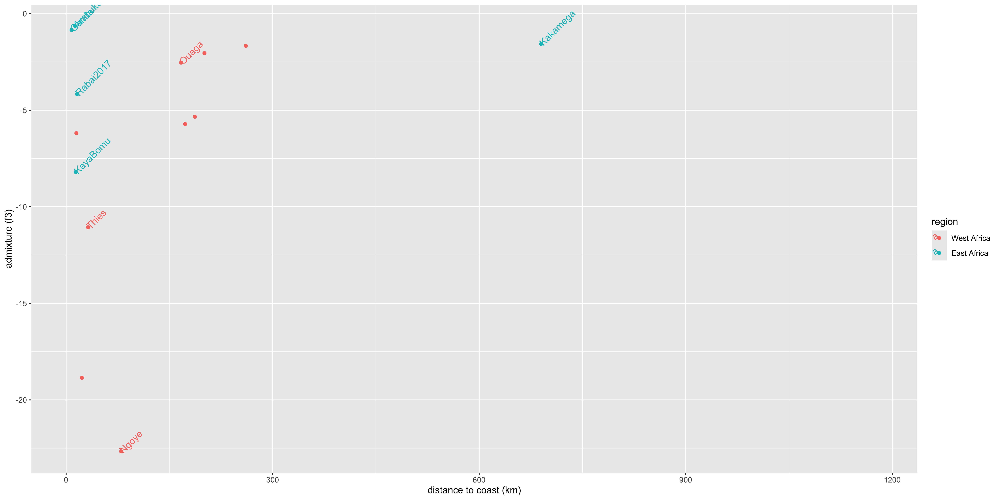

``` r
        #geom_smooth(method="lm")

distaaadot <- ggplot(dist2aaaprop,aes(x=distance,y=aaaprop,color=region,label=pop)) + 
        geom_point() +
        xlab("distance to coast (km)") + 
        ylab("aaa proportion (STRUCTURE)") +
        theme(legend.position="bottom")  #+
        #geom_smooth(method="lm")

ggplot(dist2f3z,aes(x=distance,y=f3z,color=region,label=pop)) + 
        geom_hline(yintercept=-2,linetype="dashed") +
        geom_point() +
        geom_text(data=subset(dist2f3z,country %in% c("Senegal","Burkina Faso","Kenya")),hjust=0,angle=45) + 
        xlab("distance to coast (km)") + ylab("admixture (f3)") #+
```

```
## Warning: Removed 1 row containing missing values or values outside the scale range
## (`geom_point()`).
```

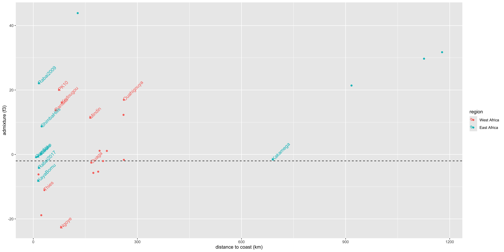

``` r
        #geom_smooth(method="lm")


dist2f3z$admixed <- dist2f3z$f3z<=-3
dist2f3z$admixed[is.na(dist2f3z$admixed)] <- F  #fill in Franceville as unadmixed

ggplot(dist2f3z,aes(x=region,color=admixed,group=paste(admixed,region),y=distance)) + 
  geom_boxplot()
```

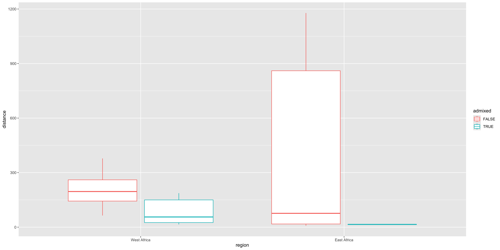

``` r
distplot <- ggplot(dist2f3z,aes(x=index,y=distance)) + 
        geom_bar(stat="identity")+
        #ylab("distance to coast (km)")+
        scale_x_continuous(limits=c(1,72),expand=c(0,0))+
        #scale_y_continuous(limits=c(0,1200),expand=c(0,0),breaks=c(0,500,1000),position = "right",
        #                   sec.axis=dup_axis(breaks=c(600),labels=c("distance to coast (km)")))+
        scale_y_continuous(limits=c(0,1200),expand=c(0,0),breaks=c(0,500,1000),position = "left")+
        theme(
            panel.background=element_rect(fill='white', color="black"),
            panel.grid = element_blank(),
            axis.title=element_blank(),
            #axis.title.y=element_text(angle=0,vjust=0.5),
            axis.text.x=element_blank(),
            axis.ticks=element_blank(),
            legend.position="right",
            plot.margin = unit(c(0,0,0,0), "cm"))


distplotL2 <- ggplot(dist2f3z,aes(x=index,y=distance)) + 
        geom_bar(stat="identity")+
        #ylab("distance to coast (km)")+
        scale_x_continuous(limits=c(1,72),expand=c(0,0))+
        scale_y_continuous(limits=c(0,1200),expand=c(0,0),breaks=c(0,500,1000),position = "right",
                          sec.axis=dup_axis(breaks=c(600),labels=c("distance to coast (km)")))+
        theme(
            panel.background=element_rect(fill='white', color="black"),
            panel.grid = element_blank(),
            axis.title=element_blank(),
            #axis.title.y=element_text(angle=0,vjust=0.5),
            axis.text.x=element_blank(),
            axis.ticks=element_blank(),
            legend.position="right",
            plot.margin = unit(c(0,0,0,0), "cm"))


svglite(paste(prefix,"inland_dist_bar_plot.svg",sep="_"))
distplot
dev.off()
```

```
## RStudioGD 
##         2
```

``` r
svglite(paste(prefix,"combined_plot_dist.svg",sep="_"),width=12,height=10)
(f3mapPW / ((
            ((distplot / f3plotPW / outplotPW /cdcplotPW / resplotPW / happlotPW) + plot_layout(heights=c(1,0.5,0.5,0.5,2,4))) 
            | plot_spacer()
            ) + plot_layout(widths=c(8,2)))
) + plot_layout(heights=c(4,6))
```

```
## Warning: Removed 4 rows containing missing values or values outside the scale range
## (`geom_raster()`).
```

``` r
dev.off()
```

```
## RStudioGD 
##         2
```


``` r
distaaadot | aaabar
```

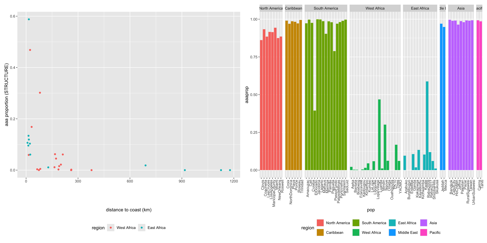


``` r
f3map_nl <- ggplot(poptotals,aes(x=longdisp, y=latdisp, label=pop,xend=long, yend=lat)) +
    geom_polygon(data = world, aes(x=long, y=lat, group=group), fill='grey70',color="grey40",size=0.2,inherit.aes=F) +
    geom_segment(data=subset(poptotals,displaced)) +
    geom_text(data=poptotals, aes(label=index)) +
    geom_rect(data=subset(poptotals,pop=="Tahiti"), 
              aes(ymin=latdisp-4,ymax=latdisp+4,
                  xmin=longdisp-4,xmax=longdisp+4),
              fill="grey95",color="black",linetype="dashed",) +
    geom_point(data=poptotals, aes(fill=f3zdisp,size=num_bams), shape=21) +
    coord_fixed(ylim=c(-48,48),xlim=c(longcut,longcut+maplen),expand = F)+
    scale_fill_gradient(low="darkblue",high="white",na.value="darkgrey") +
    theme(panel.border=element_rect(fill=NA, color="black"),
          panel.background=element_rect(fill='grey95', color=NA),
          panel.grid = element_blank(),
          axis.title=element_blank(),
          axis.text=element_blank(),
          axis.ticks=element_blank(),
          legend.position="bottom",
              plot.margin = unit(c(0,0,0,0), "cm"))

svglite(paste(prefix,"f3_map.svg",sep="_"))
f3map_nl
dev.off()
```

```
## RStudioGD 
##         2
```

``` r
aaamap_nl <- ggplot(poptotals,aes(x=longdisp, y=latdisp, label=pop,xend=long, yend=lat)) +
    geom_polygon(data = world, aes(x=long, y=lat, group=group), fill='grey70',color="grey40",size=0.2,inherit.aes=F) +
    geom_segment(data=subset(poptotals,displaced)) +
    geom_text(data=poptotals, aes(label=index)) +
    geom_rect(data=subset(poptotals,pop=="Tahiti"), 
              aes(ymin=latdisp-4,ymax=latdisp+4,
                  xmin=longdisp-4,xmax=longdisp+4),
              fill="grey95",color="black",linetype="dashed",) +
    geom_point(data=poptotals, aes(fill=aaaprop,size=num_bams), shape=21) +
    coord_fixed(ylim=c(-48,48),xlim=c(longcut,longcut+maplen),expand = F)+
    scale_fill_gradient(low="#fff7bc",high="#b2182b",na.value="darkgrey",name="Aaa ancestry") +
    theme(panel.border=element_rect(fill=NA, color="black"),
          panel.background=element_rect(fill='grey95', color=NA),
          panel.grid = element_blank(),
          axis.title=element_blank(),
          axis.text=element_blank(),
          axis.ticks=element_blank(),
          legend.position="bottom",
              plot.margin = unit(c(0,0,0,0), "cm"))

svglite(paste(prefix,"aaa_map.svg",sep="_"))
aaamap_nl
dev.off()
```

```
## RStudioGD 
##         2
```

``` r
samplemap_nl <- ggplot(poptotals,aes(x=longdisp, y=latdisp, label=pop,xend=long, yend=lat)) +
    geom_polygon(data = world, aes(x=long, y=lat, group=group), fill='grey70',color="grey40",size=0.2,inherit.aes=F) +
    geom_segment(data=subset(poptotals,displaced)) +
    geom_text(data=poptotals, aes(label=index)) +
    geom_rect(data=subset(poptotals,pop=="Tahiti"), 
              aes(ymin=latdisp-4,ymax=latdisp+4,
                  xmin=longdisp-4,xmax=longdisp+4),
              fill="grey95",color="black",linetype="dashed",) +
    geom_point(data=poptotals, aes(size=num_bams), fill="grey",shape=21) +
    coord_fixed(ylim=c(-48,48),xlim=c(longcut,longcut+maplen),expand = F)+
    theme(panel.border=element_rect(fill=NA, color="black"),
          panel.background=element_rect(fill='grey95', color=NA),
          panel.grid = element_blank(),
          axis.title=element_blank(),
          axis.text=element_blank(),
          axis.ticks=element_blank(),
          legend.position="bottom",
              plot.margin = unit(c(0,0,0,0), "cm"))
svglite(paste(prefix,"sample_map.svg",sep="_"))
samplemap_nl
dev.off()
```

```
## RStudioGD 
##         2
```

``` r
basemap_nl <- ggplot(poptotals,aes(x=longdisp, y=latdisp, label=pop,xend=long, yend=lat)) +
    geom_polygon(data = world, aes(x=long, y=lat, group=group), fill='grey70',color="grey40",size=0.2,inherit.aes=F) +
    geom_rect(data=subset(poptotals,pop=="Tahiti"), 
              aes(ymin=latdisp-4,ymax=latdisp+4,
                  xmin=longdisp-4,xmax=longdisp+4),
              fill="grey95",color="black",linetype="dashed",) +
    coord_fixed(ylim=c(-48,48),xlim=c(longcut,longcut+maplen),expand = F)+
    theme(panel.border=element_rect(fill=NA, color="black"),
          panel.background=element_rect(fill='grey95', color=NA),
          panel.grid = element_blank(),
          axis.title=element_blank(),
          axis.text=element_blank(),
          axis.ticks=element_blank(),
          legend.position="bottom",
              plot.margin = unit(c(0,0,0,0), "cm"))
svglite(paste(prefix,"base_map.svg",sep="_"))
basemap_nl
dev.off()
```

```
## RStudioGD 
##         2
```


``` r
pop4sum <- read.table("../230713_admix_4pop/admix_tests/4pop_123_summaries.txt",
                      col.names=c("p1","p2","p3","p4","chr","f4","f4se","f4z","f4sig","f4result"),fill=NA) %>%
                    mutate(p3=gsub("Cuanda","Luanda",p3))
pop4sum$f4sig <- as.logical(pop4sum$f4sig)
pop4sum$donorspp=NA
pop4sum$donorspp[pop4sum$f4 > 0 & pop4sum$f4sig] <- "AAF"
pop4sum$donorspp[pop4sum$f4 < 0 & pop4sum$f4sig] <- "AAA/pAAA"

parents <- c("Franceville","NewOrleans")
#parents <- c("Bantata","HoChiMin")
#parents <- c("Kedougou","ElDorado")
pop4sum <- subset(pop4sum,p1 %in% parents & p2 %in% parents)
pop4sum$set <- paste(pop4sum$p3,pop4sum$p1,pop4sum$p2,sep="/")
pop4sum$parent <- paste(pop4sum$p1,pop4sum$p3,sep="/")
pop4sum$f4sig <- as.logical(pop4sum$f4sig)
f4zlim=3
pop4sum$sig <- abs(pop4sum$f4z) > f4zlim
write(paste("found",nrow(pop4sum),"summary lines from",1,"files"),stderr())


poptotalsF4 <- merge(poptotals,
                     pop4sum[,c("f4","f4z","f4sig","f4result","p3")],poptotals,by.y="p3",by.x="pop")


f4map_nl <- ggplot(poptotalsF4,aes(x=longdisp, y=latdisp, label=pop,xend=long, yend=lat)) +
    geom_polygon(data = world, aes(x=long, y=lat, group=group), fill='grey70',color="grey40",size=0.2,inherit.aes=F) +
    geom_segment(data=subset(poptotalsF4,displaced)) +
    geom_point(aes(fill=f4,size=num_bams), shape=21) +
    coord_fixed(ylim=c(-48,48),xlim=c(longcut,longcut+maplen),expand = F)+
    scale_fill_gradient2(low="red",mid="white",high="blue",
                         na.value="grey",limits=c(-0.5,0.5)) +
    scale_color_manual(values=c("red","blue"),na.value="grey",guide="none") +
    theme(panel.border=element_rect(fill=NA, color="black"),
          panel.background=element_rect(fill='grey95', color=NA),
          panel.grid = element_blank(),
          axis.title=element_blank(),
          axis.text=element_blank(),
          axis.ticks=element_blank(),
          legend.position="bottom",
              plot.margin = unit(c(0,0,0,0), "cm"))

f4map_nl
```

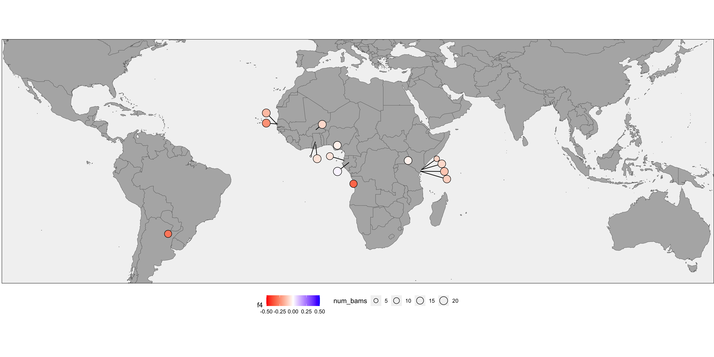

``` r
svglite(paste(prefix,"base_map_F4.svg",sep="_"))
f4map_nl
dev.off()
```

```
## RStudioGD 
##         2
```


``` r
selcnt <- subset(world,region %in% c("Argentina","USA","India"))
selcntrisk <- merge(selcnt,cdcriskall,by.x="region",by.y="country",all.x=T)
selcntrisk <- selcntrisk[order(selcntrisk$order),]

worldrisk <- merge(world,cdcriskall,by.x="region",by.y="country",all.x=T)
worldrisk <- worldrisk[order(worldrisk$order),]
worldrisk$risk <- gsub(". See map.","",worldrisk$risk)

cdcmap <- ggplot(world) +
    geom_polygon(data=worldrisk,aes(x=long, y=lat,group=group,fill=risk),color="black",size=0.2) +
    coord_fixed(ylim=c(-48,48),xlim=c(longcut,longcut+maplen),expand = F)+
    scale_fill_manual(values=c("Frequent/Continuous"="#fc4e2a",
                               "Risk varies based on region"="#fda210",
                               "Sporadic/Uncertain"="#fed976")) + 
         theme(panel.border=element_rect(fill=NA, color="black"),
          panel.background=element_rect(fill='grey95', color=NA),
          panel.grid = element_blank(),
          axis.title=element_blank(),
          axis.text=element_blank(),
          axis.ticks=element_blank(),
          legend.position="bottom",
              plot.margin = unit(c(0,0,0,0), "cm"))

cdcmap
```

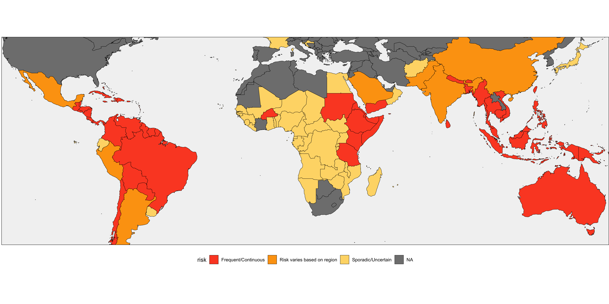

``` r
svglite(paste(prefix,"base_map_cdcrisk.svg",sep="_"))
cdcmap
dev.off()
```

```
## RStudioGD 
##         2
```

